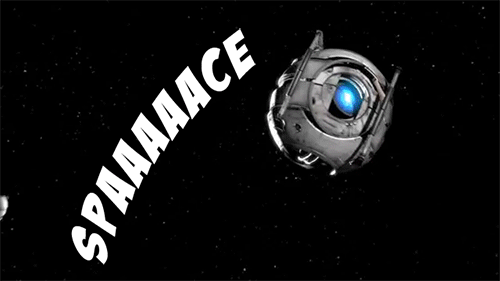

A year ago I learned that `.space` domains exist. `.space` domains are, by far, <strike>my favorite</strike> **the best** domains.

I've gone on multiple `.space` buying sprees looking for cheeky phrases that end with "space." Besides `hurtlingthrough.space`, I own `floatingthrough.space`, `lookatallthis.space`, `peopleof.space` and `humansof.space` (I've got some ideas for the `*of.space` domains). I've also looked for aerospace/astronomy terms. I've got `starsystem.space` and a few others that are related to my extravehicular activity decision support system side project (that I really ought to write about). I also own `galatic.space` and `intergalatic.space`.

...take a closer look at those last two.

**galatic**

**g a l a t i c**

That's not a word.

The word is "gala__c__tic." [See wiktionary](https://en.wiktionary.org/wiki/Galactic).

A few months after buying these two, I'm proudly showing them to my brother and talking about how I'm happy that I got in at the ground floor and found some sweet astronomy domains. Then all of a sudden, my heart is racing and I'm having this epiphany that, "oh my god, I don't know how to spell." What I'm really sitting on are some honeypot domains. As of right now, no one is doing anything with `galactic.space`, but someone is apparently using `intergalactic.space` because hitting that URL drops you into an authorization prompt for `wiki.intergalactic.space`, which is owned by `intergalactic.com`.

http://blog.npmjs.org/post/163723642530/crossenv-malware-on-the-npm-registry

https://defaultnamehere.tumblr.com/post/163734466355/operation-luigi-how-i-hacked-my-friend-without#jfuf232n3?utm_source=hackernewsletter&utm_medium=email&utm_term=fav

