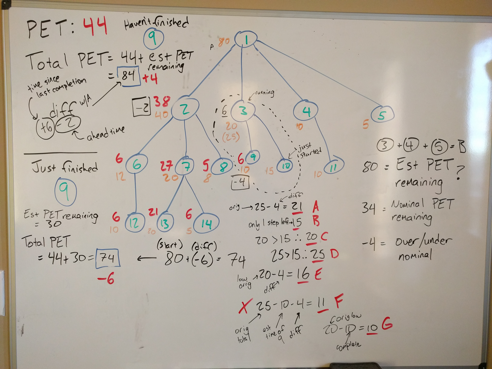
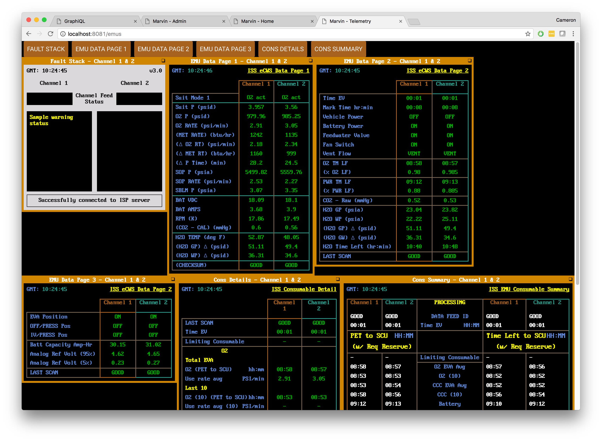

<><>start off with an image of an astronaut<><>

Human beings in spacesuits outside of spacecraft have taken some of the most remarkable pictures of the space age.

<><>insert more images of astronauts<><>

## The Backstory

Spacewalks fall under a broad mission category known as extravehicular activity (EVA).

Astronauts perform spacewalks routinely, but they're anything but routine. Crew members leave the spacecraft only when necessary, such as for hardware installations, repairs, and, during the Apollo missions, exploration.

<iframe width="560" height="315" src="https://www.youtube.com/embed/wbAF1EExpek?rel=0" frameborder="0" gesture="media" allow="encrypted-media" allowfullscreen></iframe>

_Funnily enough, this is one of the most realistic examples of EVA chatter I've seen in a movie (minus the fact they omitted the Earth-Mars time delay)._

Every astronaut on EVA faces heightened risk. They rely on localized life support systems (LSS), which provide limited consumable resources like oxygen and battery power. They face direct exposure to space, an already hostile environment even before considering the possibility of hardware malfunctions, micrometeroid impacts, sudden solar flares, and a million other incapacitating events. In the event of an emergency, crew members must react quickly and precisely to stave off disaster. In fact, over the nearly sixty-year history of EVAs, about 30%<><>cite with matthew's thesis<><> of EVAs have experienced some kind of incapacitating event that led to early ingress (coming back into the spacecraft, as opposed to egress, when a crew member exits the spacecraft).

Given the risk inherent to EVAs as well as the general complexity of EVA tasks, each EVA is a highly choreographed event, sometimes years in the making. As an extreme example, the alpha magnetic spectrometer (AMS), an external piece of hardware onboard the International Space Station (ISS), currently needs repair (I believe a valve needs to be repaired, and it's unfortunately tucked deep within a nasty nest of sharp surfaces in an awkward location). NASA built a full-scale replica of the AMS for use underwater at the Neutral Buoyancy Lab (NBL, basically a massive swimming pool for weightlessness training) and astronauts will be training for at least two years for the mission.<><>cite if possible<><> During this mission and every other EVA, crew members will be / are in constant, direct contact with personnel in Mission Control Center (MCC) at Johnson Space Center in Houston. In fact, mission operations / flight controllers at MCC (which I'll frequently abbreviate as "ops") will effectively call every shot. They will keep track of the mission timeline, task status, and suit telemetry (data describing the state of the spacesuit), and they will control most assets like the Canadarm 2 as well. The astronauts themselves are almost robots or actresses following a script with little opportunity for ad-libbing. An additional crew member inside the spacecraft, known as the intervehicle (IV) crew member, monitors many of the same variables as ground and can communicate directly with the extravehicle (EV) crew member.

The few people at risk in space benefit from dozens (maybe hundreds) of experts on the ground analyzing, predicting, and optimizing for mission success. In low Earth orbit (LEO), cis-lunar space (between Earth and the Moon) or on lunar EVAs, keeping MCC in the loop for all decision making is a viable operations concept because the speed of light allows it. ISS is only a few hundred kilometers above the ground, where the communication lag is low enough that space crew and ground personnel could reasonably play online video games together. In more official terms, we call the lag one-way latency time (OWLT). The OWLT of ISS is measured in the 10s of milliseconds.<><>check<><>. The Moon has an OWLT of just over one second. MCC to Moon communications are awkward (think a bad connection on an overseas video conference), but they still enable real-time communication and decision making. Exploration targets past the Moon, however, increasingly isolate crew members.

Most reasonable near-Earth asteroid targets are distant enough that OWLT is measured in minutes. Mars has a OWLT between 4 and 22 minutes, depending on our orbital orientation. In the worst-case scenario, roundtrip communications between Earth and Mars take a minimum of 45 minutes. Ground cannot provide anything resembling real-time direction if we're hamstrung by question-response cycles that take the better part of an hour. Clearly, we need to rethink our EVA operations concept before we get to Mars.

A NASA researcher, Matthew Miller, began working on this problem during his doctoral research at Georgia Tech. He asked how crew members could support themselves on EVA under time-delayed operations constraints. He envisioned a multi-pronged approach, where a mix of operational changes and technology would afford crew members greater independence. In a friend-of-a-friend set of circumstances, Matthew and I met two years ago and I agreed to help with the technology for his thesis, primarily by building the decision support system (DSS) software behind both the control group and a prototype with independence-enabling features. In the two years since then, we've been able to test our prototype with real astronauts on EVAs underwater on coral reefs in the Florida Keys, simulated astronauts hiking around lava flows in Hawaii and Idaho, and undergrads playing Martian explorers in laboratory controlled exercises at Georgia Tech.

The key to greater independence is augmenting the observational and predictive capability of the IV crew member who remains inside the spacecraft while her EV counterparts perform tasks outside. If an IV is as capable as the ground, our thinking goes, then the crew can safely perform EVAs without real-time support from MCC. Matthew spent hundreds of hours learning from NASA mission operations controllers, including observing ISS EVAs from MCC and interviews designed to extract the flow of information and level of importance of information on decision making during EVAs. He and I also participated in multiple analog EVA missions, during which we simulated exploration-style EVAs alongside multidisciplinary scientists, flight controllers, and operations researchers in the field. Currently, Matthew is continuing his research at [Jacobs](https://www.wehavespaceforyou.com/), a NASA contractor, where he is building a hybrid reality (VR + interactive physical objects) lab capable of repeated, controlled simulated EVAs.

Marvin (as in Marvin the Paranoid Android from _Hitchhiker's Guide to the Galaxy_) is the name of the software we eventually built to support EVA decision making.

What follows is my account of the problems we wanted to solve, the research we (mostly Matthew) did, the prototypes we built, the technical problems and mistakes along the way, and the evolution of Marvin from idea to stable software and funded research project.

### Why call it Marvin?

I love _HHG2G_ and scifi in general. Matthew hadn't read it when I suggested Marvin as the name for the project. His response: "let me read the book first before I decide if it's okay for this name to end up in my dissertation." Not long after, the name Marvin became official.

Marvin has a brain the size of the Universe but is stuck on board the Heart of Gold. I like his pithy quotes and quips about his intelligence. They felt right for a tool that would ultimately be used to help astronauts make decisions in space. I also like that it denotes some level of intelligence, like it's there to guide the crew (to safety?). The repos behind Marvin are closed source, so you'll have to take my word that they're littered with Marvin quotes and components are named after related nouns in the HHG2G world. More on the components later.

## The Baseline Control

In order to build a case for an advanced DSS prototype, we needed to determine that current technology and methodology cannot feasibly support time delayed missions. To do so, Matthew recruited Georgia Tech undergrads to take part as simulated Martian astronauts. He pared down the scope of the workload in the lab to two EVA requirements - monitoring life support and tracking the mission timeline (basically the set of actions that astronauts are scheduled to perform during EVA). These two priorities fell out of the learnings from NASA mission operations folks and we thought they were possible to tackle in the time remaining before Matthew wanted to graduate (obviously the most pressing concern for any PhD student). Incidentally, I only needed to build an Extravehicular Mobility Unit (EMU) spacesuit telemetry display. Believe it or not (and I had a really hard time believing this), a huge portion of tracking the mission timeline is done _by hand_. A mission timeline is essentially a massive spreadsheet with expected task durations, descriptions, and priorities. It is printed, 3-hole-punched, and dropped into binders. Flight controllers use pencils and calculators to follow along and make decisions. We needed make our simulated astronauts follow the same paper-based procedures.


_I took this picture of an exhibit at Adler Planetarium in Chicago. This Gemini 12 flight plan looks almost identical to the mission timelines for ISS EVAs._

<><>image of ISS EVA timeline?<><>

For reasons beyond the scope of this blog post, ops still follows some of the same general methodologies from the Gemini and Apollo years. There have been many advances, of course, but they have yet to completely separate from pencil-and-paper tracking. During an EVA, ops personnel need to track the time remaining until LSS can no longer support operations (this is a nice euphemism for "time until astronauts will die because they're out of oxygen"). There are four resources that could potentially be _limiting_ consumables - battery power, oxygen, CO<sub>2</sub> scrubbers, and water. The loss of any single consumable means the suit no longer supports survival. The _limiting consumable_ is the consumable resource of the four listed that will run out _first_, which may change moment-to-moment during an EVA. You calculate how much "buffer" an astronaut has to complete a mission using:

$$
\begin{aligned}
t_{lc} &= \text{time until limiting consumable is depleted} \\
t_{t} &= \text{time remaining to complete tasks} \\
\text{buffer} &= t_{lc} - t_{t}
\end{aligned}
$$

Obviously, everyone wants to maximize this buffer. If it goes too low (or negative!), the team will start cutting tasks.

Similarly, ops needs to know how far ahead or behind the EV crew currently is compared to a nominal (a more fun word for "normal") timeline. Missions often have hard time limits, eg. the crew cannot remain outside for more than four hours. Decisions to keep, cut, or, on rare occasions, add tasks to the timeline depend on an accurate and up-to-date time ahead / time behind calculation. This is a much more difficult calculation because you have to consider the expected duration and completion state (unstarted, completed, aborted, currently executing) of every single task in the timeline. There may be upwards of _hundreds_ of tasks with expected durations at varying levels of accuracy. With the way missions are planned, there are often durations associated with key transitions, such as reaching a traversal checkpoint in 30 minutes or finishing an installation in 75 minutes. At these transition points, it's easy to calculate time ahead / behind. In the middle of tasks, however, the timeline looks fuzzier. Ops may even depend more on intuition than calculations to estimate time ahead / behind. To make matters even worse, there are often multiple crew members outside simultaneously on EVA _performing separate tasks_. Each decision relies on taking each astronaut's individual timeline into account.



_This is a sketch from a planning session where we were trying to nail down time calculations. To read this graph, each numbered node represents a "step" in the timeline. Steps can have substeps (more on this later). The red number to the top left of each step is the actual duration of a step. The orange number to the bottom left is the expected duration. The timeline is currently on step 10. A, B, C, D, E, F, and G are examples of different ways of we considered calculating time ahead / time behind (I don't remember the rationale behind all of them). Note that "PET" refers to phased elapsed time, a running clock that starts when the first EV egresses, and ends when the last EV ingresses._

Tracking a timeline by hand necessitates _manually_ performing the aforementioned calculations. A mission controller will have to repeatedly perform time math throughout the duration of the EVA. While these calculations only consist of addition and subtraction, the multilayered aspect of tasks in a timeline, the multitaskedness of monitoring an EVA, and the base-60 math all lead to a high likelihood that a mission controller will make a mistake or be prohibitively slow.

In fact, the baseline experiment demonstrated a rough range for just how errant and how slow manual timeline calculations can be.

In the baseline experiment, Matthew tested an IV crew member's ability to perform timeline calculations, with a focus on measuring their speed and accuracy. He recruited Georgia Tech undergrads to play simulated Martian explorers. The experiment setup consisted of two "EV" crew members reading from a script and a single "IV" crew member physically separated from the EV crew. The IV and EV crew were able to communicate real-time with voice and text. They simulated 35 minutes of an EVA, during which the IV crew member (ie. test subject) supported the two EV crew members as they approached an exploration site and began surveying and sampling. The scenario given was that the EVA had been in progress for a few hours and the previous IV operator was handing over control to the test subject. As participants, they had access to an EMU telemetry display (LSS data) and printed timelines in the same format as ISS EVA mission timelines.



_This is a working clone of MCC's telemetry display. More on this in a bit._

<><>insert shot of paper product<><>

<><>insert shot of the setup at GT<><>

<><>insert labeled desk<><>

Throughout the EVA, the IV crew members were tasked with providing the time ahead / time behind calculation and the buffer (also known as the margin) to EV when asked. They had to perform the same calculations whenever the EV crew finished a task, and then write down the results in the timeline. While working, they had to maintain a conversation with the EV crew about science objectives, as well as keep an eye on the EMU telemetry displays to alert the crew and record when anomalous telemetry readings occurred. The full results of the experiment live <><>[here in Matthew's dissertation](link to dissertation<><>)<><>, but the gist of the findings is that the IV crew takes upwards of almost two minutes to perform timeline calculations by hand, with an error of **±1 hour** (an EVA is generally 4-6 hours). This is, of course, very significant. You could easily argue that selecting better IV operators and putting them through extensive training would improve speed and reduce errors, and you would be right. But there is more to being a good astronaut than quickly doing math in your head. Computers are _really_ good at math - why not make them do the calculations for us?

## Interlude - Building the Baseline EMU Telemetry Displays

<><>EMU close up (maybe a gif zooming into it?)<><>

<><>EMU graphs<><>

I built the first version of the baseline tool almost two years ago. I started from blurry screenshots of the eponymous displays at MCC. I wanted to replicate the look and behavior of the displays. Matthew also needed to be able to upload arbitrary data to play out in front of the test subjects. He would start and stop the sim at will. He also needed to match IV actions with telemetry data. As such, there needed to be a server that Matthew could upload data to and later coordinate its presentation. At the time I started work on this project, I knew JavaScript and [Node](https://nodejs.org/en/) best, so that's what I used.

I would love to simply post links to the GitHub repos here and point you to relevant sections, but everything I'm describing in this blog post is closed source. Both Georgia Tech and NASA own the code (gotta be honest, it felt really cool to type that sentence) so I'll post snippets where I can but otherwise you'll have to believe me that this is a real, working project.

I should probably mention at this point that I have a known problem when it comes to any work related to space and astronauts - my imagination takes over. Matthew says, "we're going to test this with surrogate astronauts" and I hear, "we're going to start with surrogate astronauts, but we should be running live missions on ISS in the next 6 months." I make more work for myself. This is a pattern that started here and continued until I became cognizant of the issue and adjusted for it. ("Hey, maybe I don't need to design this HTTP retry logic around a 22 minute time delay and can stick with, you know, Earth assumptions for now.")

My imagination issue first surfaced here. I wanted to design a system that would mimic a real-world hardware setup as closely as possible... because you never know when you're going to get the call to deploy in ISS. When Matthew and I started working together, I told him this project would be no problem. But truth be told, this was my first large-ish application I was going to build from scratch. It's evident in a few things, like the lack of tests (I didn't know how to write them) and the poor organization (I didn't really understand composing modules and libraries). But I'm still quite proud of what I built and how I managed to create a fairly reliable application.

I separated the task into a linear flow of information. Matthew would upload a CSV with a timeseries of telemetry data. My servers would be responsible for parsing the information and eventually uploading it to front end clients.

### Front End

I like starting from the end. The front end client was a [Polymer](https://www.polymer-project.org/) app. I picked Polymer because I was spending those days working with a lot of Googlers working on front end courses at Udacity. I liked the way Polymer used more native APIs to achieve componentization. I appreciated how Polymer got out of the way and allowed me to use normal HTML, JS and CSS to build sites, as opposed to the hotness at the time, Angular 1, that was, and still is, a monster. Given that I was building a "dumb" display without the need to accept any input from the user, Polymer felt like a good choice.

The final design of the site took advantage of ideas I had gleaned from the first few videos the React team released, namely the focus on a one-way flow. Inside the app, there was a `Model` dict that held the source of truth for each data point. I used a "flag and fetch" technique. The components themselves have a string attribute indicating what key in the `Model` they should display. Each component also held an update flag. When new data arrived and the `Model` got updated, the app would flip the flag and component would retrieve the new value to be displayed. Originally, I bound telemetry data directly to each component but this led to performance issues. There were dozens of components and each new piece of data (later, the key in the `Model`) would trigger a new cycle of JS, layout, compositing and painting. As a result, Polymer would attempt to update the display so rapidly that the framerate would grind to a halt.

I used [D3](https://d3js.org/) to build the graphs. The D3 components simply aggregated data into connected points for line graphs. While this worked well, the graphs could only render what data they had received. Given that Matthew wanted to drop test subjects into the middle of an EVA, I had to develop a way to render the "earlier" parts of the telemetry graphs. I'm still not convinced I took the right strategy here, but I wound up using a server-side technique to blast earlier timeseries data before a run started. Matthew would essentially fast-forward to the starting point in the EVA. The graphs also had a quirk in that I never developed a way to remove data. If you never refreshed the page, old line graphs would awkwardly stack on top of each other, so Matthew was tasked with refreshing all of the graph pages between runs.

### Servers

Yes, "server**s**." I used three Node apps and a [Redis](https://redis.io/) database to mimic a hardware sensor monitoring flow. Here's how it looked.

```
CSV -> Hardware app -> Sensor app -> Redis database -> Client app -> clients
```

To be fair, I liked that the apps were separate. I thought it was reasonable to imagine that you would have separate servers in an EVA scenario. The Hardware app would simulate the hardware generating the actual data. The Sensor app would simulate some kind of receiver tasked with reading raw hardware data and turning it into structured information. You would want that information to be stored in a database, hence the Redis database. And you would want to be able to broadcast that information, which was the job of the Client app. This is, of course, hypothetical. In no way, shape, or form would this app ever be used in a flight-like environment. To be fair though, I still think this flow makes sense and even if I might structure the system differently, there isn't necessarily an inherent gain in merging the separate apps into a monolithic app. It would just be a bit simpler to deploy.

The Hardware app existed to read an uploaded CSV and control the current time of the EVA. Each row in the CSV contained a mission time column (called PET or "phased elapsed time"). The Hardware app read from the CSV and exposed an admin website. On the admin site, Matthew could upload CSV files as well as start and stop the EVA. Additionally, I added a hack to fast-forward mission time by simply looping through timestamps and broadcasting data until it reached the desired time. Fast-forwarding allowed Matthew to start EVA simulations at arbitrary mission times and the participants would see graphs with data from before the handoff.

We devised a taxonomy of channel (EV1 or EV2), domain (H<sub>2</sub>O, battery, etc), and subdomain (volume remaining, voltage, etc) to describe each sensor. The Sensor app received readings from the Hardware app and determined to which sensor each belonged. The CSV included most, but not all, data. The Sensor app used some telemetry values to dynamically calculate others, such as the limiting consumable. Once finished, it fired off structured data to Redis for storage. I used Redis rather than a more traditional relational database (RDB) because of Redis' speed and publish/subscribe (pubsub) capabilities. While the Sensor app published data to Redis, the Client app would create subscriptions to receive new data as it arrives. Redis acted as a pipe that stored information as it was passed from the Sensor app to the Client app. In theory, this would allow us to retroactively determine what telemetry data was available at any given moment, however we never needed this feature. Given that Matthew was uploading CSVs with known data, we actually knew ahead of time what telemetry would be visible at every moment of the simulation. It's not hard to argue that the addition of Redis was an unnecessary layer of complexity caused by my overeager imagination.

At the end of the pipeline, the Client app received new readings from Redis and then published them to front end clients using websocket connections (specifically, [socket.io](https://socket.io/)).

## The Advanced DSS, aka Marvin v1

Early on, Matthew and I started brainstorming what the workflow for an IV operator in deep space should look like. What kind of information would they want? What kind of actions could we reasonably expect an IV operator to take? Remember, this IV operator would be in a loud, small, metal tube with overlapping voices in their ear, a half-dozen screens in front of them, monitoring the life support of the EV crew and their home vessel, keeping track of EVA progress, coordinating with scientists and flight controllers in Houston, making sure scientific objectives get hit, all while ultimately taking responsibility for crew safety and mission success. These are long days with 8 or 10 hours devoted to missions. The IV operator may be stressed and exhausted. With a plate so full, what could we add that's both easy to do and high fidelity enough to be helpful? We landed on a single click.

<><>image of Marvin UI<><>

_The Marvin timeline view_

<><>screenshot of Inbox<><>

Marvin consists of a UI that I <strike>basically stole</strike> borrowed from [Google Inbox](https://www.google.com/inbox/) (a fantastic replacement for the traditional gmail UI). Inbox makes it easier to navigate your inbox by giving you separate categories into which your emails get sorted. You don't see emails when you open Inbox, you see categories. Click on a category and it expands to show your recent emails. In a way, your inbox gains a hierarchy that makes it easier to grok. This hierarchy inspired the hierarchy we wanted for steps. Incidentally, we realized that no one wanted collapsible categories in Marvin and it was removed for later versions.


We started with brainstorming sessions. The UI began with markers on a whiteboard and then turned into digital mockups built with Apple Keynote.

<><>image of one of the first mockups<><>

We decided to give IV operators a single click to indicate when a task is complete. We envisioned that as the mission progresses, the operator checks off tasks. Each click updates a high level display at the top of the UI with timeline calculations, including the time ahead / time behind, the timeline buffer, the time until the next activity starts, the time until the limiting consumable expires, and the predicted time until the mission ends (the exact metrics changed between missions). We wanted to give IV operators two ways to view the timeline - in detail and at a high level. We wanted to give them a way to quickly spot where the crew is in relation to the rest of the timeline. This feature wound up being useful in our _in situ_ trials but went unused at NEEMO.

### Timeline Hierarchy

We needed to create a well-defined structure for steps in the timeline. This started with a sketch in my notebook.

<><>image of notebook with hierarchy<><>

We agreed that it contained enough information and I translated it to JavaScript. It was ugly.

```js
class Step {
  ... properties
  children = [];
}
```

The `children` array took a naive view on representing nested `Steps`. We made child `Step`s literal children of their parents. In order to find `Step`s in the timeline, I implemented a depth-first search with a number of options for filtering and sorting results.

```js
<><>insert depth first search<><>
```

I modeled this API after the nodes and `document.querySelector` APIs in the browser. Note that there is no early termination in the base-implementation. We run searches against the timeline in `O(N)`, regardless of when we find a hit. We noticed that performance took a noticeable hit as we built timelines with realistic levels of detail. Each timeline calculation could cause dozens of traverses through the timeline. In some implementations, the performance hit was worse because we established a pattern of destroying and rebuilding the timeline between each "tick" in the timeline (usually running at a 1 second tick).

In the first implementation of Marvin, I built a self-contained Electron app. The app included a PouchDB in-memory database, JavaScript for timeline calculations (the library is called EVA.js), an app-side front-end for rendering the timeline, and it exposed an ExpressJS server that served the exact same rendered front-end, the only notable difference being that the served front-end clients would receive timeline changes over the network.

I separated timeline data into two distinct domains - metadata and ephemeral run data. Metadata included information that would remain the same between runs, such as the name of tasks and expected durations. Ephemeral timing data was the record of when the timeline started and stopped as well as when each individual `Step` started and stopped. I recorded ephemeral timing data in PouchDB, which, like Redis, supports pubsub. My front-end clients listened for timing information from PouchDB and then updated and re-rendered their timelines. If a user clicked on a step to indicate that the step was completed, they would send an event to PouchDB, which would subsequently notify all other clients, who would re-calculate timeline metrics and re-render their displays.

I finished a stable build just in time for BASALT November 2016  at Mauna Loa, Hawaii. Matthew ran Marvin on his laptop, which our simulated IV operators used to time the mission. Here, we used Marvin in conjunction with other tools to test its results compared to what the team was already using, like spreadsheets with custom macros.

Let's take a look at some snippets of code and see how we could have improved performance.

### Memoizing

<><>show the unoptimized devtools timeline<><>

This is a screenshot of devtools in the midst of running timeline calculations. You can see that there are repeated deep, thin chunks of work. These are the aforementioned timeline traversals. Blargh, Paul would not be happy.

In this build of Marvin, we made the assumption that timeline metadata would not change during a mission. Hence, the structure of the timeline doesn't change either. If that's the case, each query for a `Step` in the timeline is deterministic and there's no need to re-traverse the entire timeline to find one that's already been accessed. Rather than optimizing searching itself, I implemented a simple memoizer<><>link?<><> that would return previously queried for `Step`s from a cache. Here's what the timeline looked like afterwards! The performance felt noticeably better too.

<><>image of post-memoized timeline<><>

### Pessimistic vs Optimistic Time Calculations

We ran into an interesting issue at BASALT when we compared our results to the team's existing results. Marvin originally took a  pessimistic view when calculating time remaining in a step. For example, assume you have a parent with children that looks like so:

<><>parent with a couple children, the first few are done, the last few are not<><>

In this case, Marvin would sum up the completed tasks and subtract that from the overall expected duration:

```js
pull code from EVA.js about time remaining
```

Note that we _do not_ subtract the time that has passed in the _current_ `Step`. This means that we do not assume a step will finish on time before it has been marked complete. This led to us overestimating the amount of time before a parent is complete. We found that this was undesirable as the team's existing tools _would_ assume that a `Step` is going to be completed on time unless it has already gone over. Here's what the updated algorithm looks like:

```js
algorithm where we subtract time elapsed
```

This brings up the importance of detail. As time elapses in a single step, our calculations would get worse and worse as we always assumed worse-case scenario until the IV operator proved us wrong and check off the step. Essentially, the timeline became less accurate as time elapsed _after_ checking off a step. If these `Step`s are multi-hour, high-level activities, it isn't hard to imagine that our calculated time remaining could be wrong by hours as well. This adds incentive to make detailed timelines. Of course, it also penalizes you for using a less than detailed timeline. Especially at this early stage of adoption, it makes sense to avoid disincentivising anyone from using Marvin, so the switch to a lenient time remaining calculation made sense.

## Marvin v2

In the run up to NEEMO 2017, I decided that the previous version of Marvin was too unstable for my liking. We were reliant on the stability of a _browser window_, something that may crash at any time for no reason whatsoever. Chrome is already a memory hog, and we needed to load a few hundred more megs of RAM into a window, constantly run CPU intensive calculations, and hope that it could somehow remain stable for hours at a time. NEEMO was a huge opportunity. Actual astronauts using Marvin! It’s a collaboration between NASA, ESA, and JAXA. An underwater base of operations in the Florida Keys where astronauts and researchers meet to study and practice EVAs on a Coral Reef. Aquarius Reef Base has been called the most realistic setting to ISS - it’s a cramped metal tube where multiple people are stuck for long periods of time. There is no immediate rescue. In fact, it’s actually faster to get back to Earth from ISS. Astronauts can evacuate ISS into a capsule and reach the ground in about 6 hours. Due to being depth saturated in Aquarius, aquanauts need a full day to depressurize and surface safely (there are special depressurization chambers on land in the event of emergency).

Given the chance to put my software in the hands of real astronauts, I couldn’t risk hinging stability on a _Chrome tab_.  Furthermore, I needed to integrate telemetry, which Matthew had been running separately with the baseline tool<><>link<><>. I decided it made sense to reengineer Marvin as a small cluster of microservices <><>link<><>. I decided to call the new system the Heart of Gold, named after Marvin’s home ship in HHG2G. Here’s the architecture I ended on:

<><>insert image of heart of gold architecture<><>

### Heart of Gold Architecture and Communications between components

### Deploying

### Using TypeScript

### Tests (probably more on tests everywhere)

### Monitoring

### improving front-end performance by moving all calculation logic away

### Improved database capabilities - graphql

### 