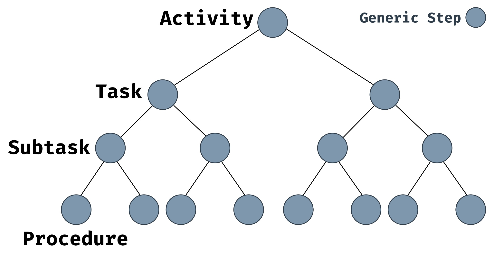
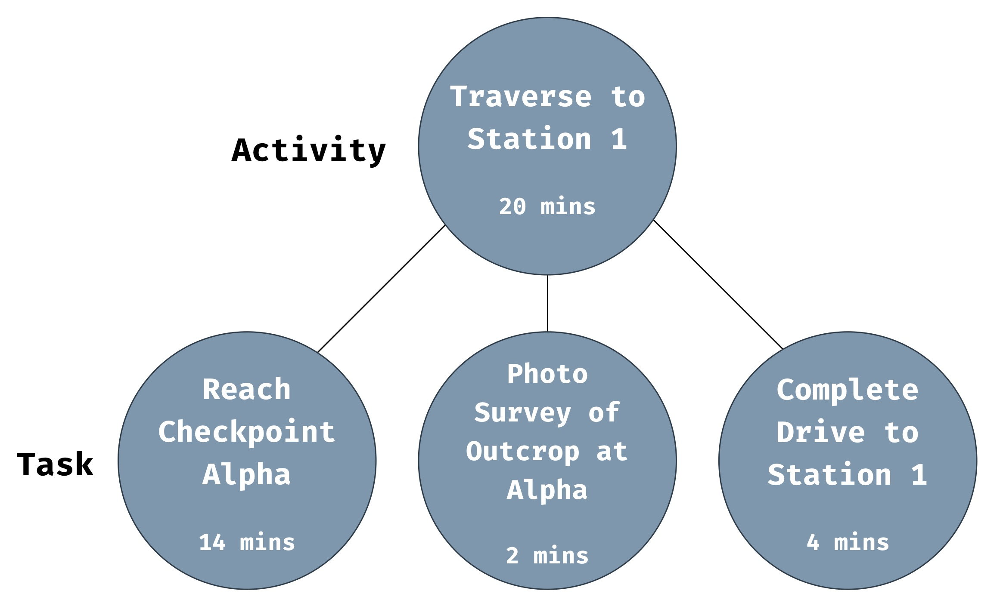

_This is part 2 of the Marvin series. Here’s [part 1](/posts/20180115-marvin-deep-spacewalks/) about why extravehicular activity (EVA) operations research matters._

<p class="lead-in">It's the early 1960s. Picture yourself in a meeting at NASA with scientists, engineers, flight controllers, and astronauts. Everyone's wearing horn-rimmed glasses, short sleeved shirts, and thin black ties. The summer humidity in Houston makes the air sticky. You feel your allergies flaring up from the cigarette smoke wafting over the table, but you easily ignore your discomfort though because you’re talking about landing on the Moon in the next decade.</p>

The astronauts want to know what kind of flight controls the Lunar Module will have. The engineers are wringing their hands about life support systems because humans are so damned difficult to keep functioning compared to abiotic satellites. An administrator hounds the astronauts about their scheduled public appearances to drum up support about beating the Russians who just put Yuri Gagarin in space. With a polite _ahem_, the scientists bring up the topic of what exactly the astronauts should sample on the Moon. The flight controllers nod in agreement.

"Yes," the flight controllers say, "we're glad you brought that up."


_Yuri Gagarin, a cosmonaut and the first person in space. What a badass. He orbited the Earth for the first time on 12 April 1961, adding fuel to NASA's drive to beat ROSCOSMOS (or Роскосмос in Russian) to the Moon. Image from [here](https://news.nationalgeographic.com/news/2011/04/110412-yuri-gagarin-anniversary-google-doodle-first-orbit-space-science/#/34466.jpg) by Popperfoto/Getty Images._

This is where the story of Marvin picks up - planning spacewalks. Looking through the history of space exploration, human-performed exploration is a rare phenomenon. All astronauts are explorers in the philosophical sense, but only a few astronauts have explored in the Darwin-in-the-Galapagos kind of way. The first EVAs tested engineering limits. Same as the Space Shuttle crews before them, modern spacewalkers on the International Space Station (ISS) are construction workers in space performing engineering tasks on engineered surfaces. Only the EV crews on Apollo 15 - 17 stepped out of an airlock with the goal of finding something cool outside.

## Apollo Moonwalks

Early Martian EVAs will likely mimic the pattern established in the Apollo missions. Engineering objectives outweighed scientific objectives on the first lunar landings, Apollo 11 - 14, during which lunar pioneers _egressed_ (meaning they left the airlock; as opposed to _ingressed_ when they reentered the airlock) to stretch their legs on the regolith and test equipment and procedures. The EV crews on the later missions, Apollo 15 - 17, focused on lunar science. Notably, the Apollo 17 crew included [Harrison Schmitt, the first and only PhD geologist to do field work on a different world](https://www.space.com/20789-harrison-schmitt-astronaut-biography.html).


_Harrison Schmitt uses a lunar rake to sift through the regolith for samples between 0.5 and 1 inch in size. This photo was taken during the first EVA of Apollo 17 at Station 1. Image from [NASA](https://www.nasa.gov/audience/foreducators/spacesuits/historygallery/ap-dec72.html)._

If you want to optimize a procedure, whether it's tying a shoe or doing interplanetary science, you need to test. You need to make mistakes and learn from them. In that vein, exploration EVAs are uncharted territory. There are only nine examples of exploration EVAs, all of which come from Apollo 15 - 17. As the possibility of future lunar, asteroidal, and Martian EVAs looms on the horizon in the next decades, researchers like Matthew Miller have been [revisiting Apollo missions](http://www.news.gatech.edu/features/lunar-landing-logs) in an effort to learn as much as possible about the human factors and operational concepts - the collection of rules, information flows, and decision making strategies - that influence EVA mission success.

NASA obsessively plans EVAs for good reason. With higher resolution understanding of the state of an EVA, the better we can prevent unforeseen circumstances from derailing objectives. Apollo EVA planned timelines have minute level resolution, as in, we know what astronauts _should_ have been doing during every 60 second period of the mission. Of course, what _actually_ happened is a different story. In a paper last year, Matthew and other operations researchers compared planned and executed timelines from the lunar EVAs of Apollo 14 - 17.[^1] We generally call this comparison the _time behind_, which reflects the fact that EVAs tend to fall behind schedule. Given that a timeline consists of an un-gapped sequence of tasks, each with a defined start time (more on how tasks are defined in a moment), you can calculate the deviation between the planned and executed timelines with:

[^1]: Miller, M., Claybrook, A., Greelund, S., Marquez, J., Feigh, K (2017) Operational Assessment of Apollo Lunar Surface Extravehicular Activity. NASA/TP-2017-219457, ARC-E-DAA-TN39193, NASA Ames Research Center. Available at https://ntrs.nasa.gov/search.jsp?R=20170007261 \[Verified 3 Feb 2018\]. ([PDF here](https://ntrs.nasa.gov/archive/nasa/casi.ntrs.nasa.gov/20170007261.pdf).)

$$
\begin{aligned}
\text{time behind} = &\text{actual mission clock at start of task} \\
&- \text{planned mission clock at start of task}
\end{aligned}
$$

The mission clock is called the Phased Elapsed Time (PET). It starts at 00:00 (HH:MM usually) when the first crew member egresses and counts up until the last crew member ingresses.

EVAs begin with egress and equipment checks. Once complete, EV crews cycle between three categories of activities - traversal, overhead, and station activities. During traversal activities EV crews relocate to a worksite. Either before they leave or once they arrive at the worksite, they perform overhead tasks, which generally consist of preparing equipment for the next phase, station activity. Here, crews use equipment to perform tasks and complete high-level mission objectives. Once finished, they may either traverse to another worksite or enter an overhead activity to manage equipment. The cycle repeats multiple times before before EV crews finally ingress.

Matthew and co. took a look at how time behind varied on average throughout Apollo 14 - 17 exploration EVAs. Take a look at this graph.


_Miller et al,[^1] page 66, figure 33. Average time behind for Apollo 14 - 17 EVAs. Time behind generally increased as missions progressed. The x-axis shows PET and the y-axis is time behind. Phase 1 is mostly egress and overhead, phase 2 and 3 consist of cycles of traversal and station activities with little overhead. Phase 4 finished the EVA with completing station activities and ingress._

Time behind got worse as EVAs progressed. Egressing generally proceeded at a nominal pace (NASA-speak for "expected" or "within acceptable bounds"), but pretty much everything else took longer than expected. In fact, after phase 1, 79% of all tasks were behind schedule (Miller et al,[^1] page 64, section 4.5.1). The few points that contradict the general trend almost always benefited from cutting prior tasks from the as-performed timeline.

I'll leave diving into the full set of statistics as an exercise for the curious. (I recommend reading section 4.5, "Aggregate EVA Timeline Execution Trends," of Miller et al[^1] for a fascinating summary of timeline trends.) Suffice it to say that science _always_ takes more time than you think. But that's no excuse for failing to stick to a timeline when you're aware of the tendency for delays and you have the planning time to preempt them. Marvin is our first attempt at subverting exploration EVAs that run fashionably late. The first step we took towards keeping tighter EVA timelines was creating a detailed language to describe them. In other words, we wanted a schema.[^2]

[^2]: A database schema is a formal method for representing relationships between data. [This is a decent introduction to them](http://database.guide/what-is-a-database-schema/) (feel free to ignore the technical details). This quote provides some good context: "Schema is used in psychology to describe an organised pattern of thought or behaviour that organises categories of information and the relationships among them."

## Timeline Schemas

Looking at the timelines below, it's clear that they haven't changed much since the 1960s. High-level outlines describe broad phases of the mission and low-level procedures provide minute-by-minute, atomic level details.


_This Gemini 12 flight plan has the same structure as today's EVA timelines. I took this picture at Adler Planetarium in Chicago._


_A page from the first EVA of Apollo 17. Note that there are both high level details ("EGRESS") with detailed procedures ("TURN ON 16 MM CAMERA") as insets. Miller et al,[^1] page 9, figure 2._


_The high level summary (top) and an example detailed task view (bottom) from the timeline for US EVA 22 on 9 July 2013. Astronauts Chris Cassidy and Luca Parmitano [began preparations to install a new ISS module](http://www.spaceflight101.net/iss-expedition-36-us-eva-22.html), the [Russian Multipurpose Laboratory Module](http://www.russianspaceweb.com/iss%5ffgb2.html) (Nauka or Нау́ка in Russian). They completed this 6 hour timeline almost perfectly on time. Take a look at the bottom of the first column of the detailed task view - you can see boxes where the intravehicular (IV) crew member - the astronaut inside the habitat - is expected to record the number of turns used to install bolts. This level of detail is not uncommon. Check out the [full timeline](https://www.nasa.gov/sites/default/files/files/US%5fEVA%5f22%5fTimeline.pdf) to see why it takes years to prepare for a single spacewalk. Also interesting to note: you can see that EV2 was asked to take a survey photo of the Alpha Magnetic Spectrometer (AMS). This EVA occurred two years after the AMS was launched and, at the time, did not yet need the repairs discussed [before](/posts/20180115-marvin-deep-spacewalks/) - this was just a survey to assess its health._

Using modern and historical timelines as inspiration, Matthew and I designed a hierarchical schema that adequately encapsulates all the information from high level summaries to detailed, minute-by-minute procedures. (Though, as we'll see in a later post, it does not facilitate timeline calculations in and of itself.) As you move down in the hierarchy what it describes becomes more and more specific.



The hierarchy is as follows: Activity → Task → Subtask → Procedure. At the bottom, a Procedure represents an a single action, such as tightening a bolt. At the top, an Activity describes upwards of hours of mission time. We generalized the idea of an action the astronauts could take on EVA to something we called a Step, with a capital 'S' to distinguish it as a formal name for a defined data structure (from now on, capitalized versions of Step, Timeline, Activity, Task, Subtask, and Procedure represent the digital manifestations of their operational counterparts).


It's useful to apply familial terms to describe the relationship between elements in a tree like the Timeline. An Activity is the _parent_ to a Task, while a Task is a _child_ of an Activity. Two Tasks that belong to the same Activity are _siblings_.

It's easy to translate current timelines to our chosen data structure.


_This is how we translated ISS timelines to the schema we designed. For example, you can see that the Task of SSU CLEAN UP has seven Subtasks that belong to it, and the third Subtask has some procedural information that belongs to it. From Matthew's PhD thesis,[^3] page 138, figure 4.16._

[^3]: [Matthew's thesis](https://doi.org/10.13140/rg.2.2.17731.30248):<br>Miller, Matthew. (2017). Decision Support System Development for Human Extravehicular Activity. . 10.13140/RG.2.2.17731.30248.

The naive (but still useful) approach to building a Timeline is relatively straightforward. I'm going to use [TypeScript](https://www.typescriptlang.org/) to exemplify how we built it.

A Step only needs a short description to identify it. An expected duration provides the timing data needed to do timeline calculations.

```typescript
class Step {
	description:      string; // a few word description
	expectedDuration: number; // the amount of time in minutes this Step should take
}
```

Additionally, a Step can have zero or more children. This is how we built parent-child relationships.

```typescript
class Step {
	description:      string;
	expectedDuration: number;
	children:         Step[]; // a list of other Steps
}
```

Specifically, an Activity can only have Task children.

```typescript
class Activity extends Step {
	// everything is the same except...
	children: Task[]; // a list of Tasks
}
```

Tasks and Subtasks look the same except for their type of children. Procedures do not have children.

## An Envisioned Martian Spacewalk

In order to get a sense for how our Timeline works and its strengths and weaknesses, let's imagine what one might look like when the first people are roving around doing science on Mars.


_Maybe this is what they'll see? The Curiosity Mars rover took [this amazing panorama](https://photojournal.jpl.nasa.gov/catalog/PIA22210) of Gale Crater in October 2017. Image copyright NASA/JPL._



_In this sample Timeline, there is a traversal Activity to Station 1. During the Activity, the EV crew will perform 3 Tasks: drive to checkpoint alpha, perform a photographic survey of a rock outcropping there, and finish the drive._

The Activity is the top of the Timeline, so let's create that first.

```typescript
let activity = new Activity();  // creates an Activity
activity.description = 'Traverse to Station 1';
activity.expectedDuration = 20; // time in minutes to reach the target location
```

An Activity can only have Task children. Let's create the Tasks that we expect astronauts to perform on the way to target alpha.

```typescript
let task1 = new Task();
task1.description = 'Drive to Checkpoint Alpha';
task1.expectedDuration = 14; // 14 minutes of drive time

let task2 = new Task();
task2.description = 'Photographic Survey of Outcropping at Alpha';
task2.expectedDuration = 2; // 2 minutes to take photos

let task3 = new Task();
task3.description = 'Finish Drive to Station 1';
task3.expectedDuration = 4; // 4 minutes to finish the drive
```

Right now, we have four freefloating Steps: `activity`, `task1`, `task2`, and `task3`. We need to give them some structure. To do so, we're putting the Tasks in a list and making them the children of the Activity.

```typescript
activity.children = [task1, task2, task3];
```

Now that there is a relationship between the Steps, we can try some basic timeline calculations.

<><>show task 1 done<><>


## Limitations of our Design

We took a naive approach in developing the Timeline.


<><>the problems the linear timeline solved<><>

<><>how the hierarchy has affected decision making - less flexibility for on-the-fly changes. difficulty with unknown number of cycles<><>


I've been in meetings where we have a 20 minute discussion about the different ways to strike a rock with a hammer and what they're called. There were factions within the geologists, notably by nationality. At one point, a Brit tossed out the term "cheeky knock," which instantly became canon and I'm sure has since been published in geology papers about BASALT.

"In particular, the Apollo program pioneered
the concept of incorporating a team of scientists to support real-time and strategic
decision making regarding human surface operations" p5

section 1.2 - all about structure of timelines

"An EVA timeline is
a compiled, sequenced set of tasks at various levels of description which contains
the geospatial and temporal information associated with all tasks to be performed" p8

p15, 16 - start description of timeline structure
p18 - measuring tasks. is a task duration really the diff between its start time and the next's? (probably good to hint at Marvin's step duration definition (no dead time))
