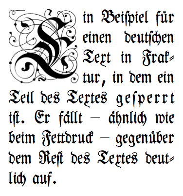
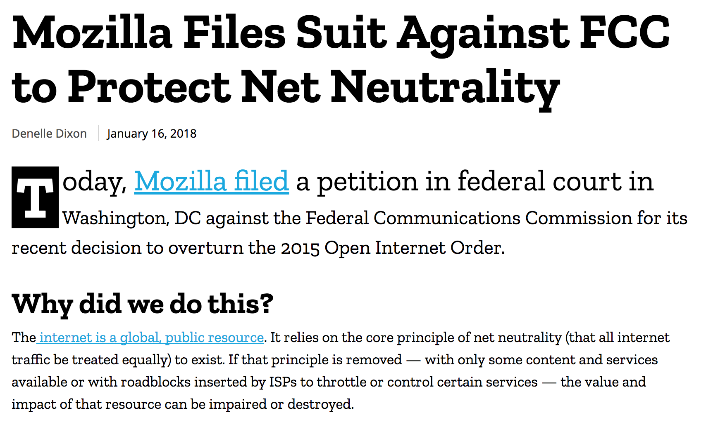

It's hard to do front-end development and _not_ notice the little things about other websites. Extra margin here, great responsiveness there, etc. In particular, I love typography. Not enough that I would take on a career as a designer, but I appreciate a well put together piece of text. I'm working on another long post article about [Marvin](/posts/20180115-marvin-deep-spacewalks/) right now and decided to get fancy with my lead in text.



_[Not this fancy](https://commons.wikimedia.org/wiki/File:Emphasis%5Ftypography2.png)._

The big first letter is something called "drop caps," which was news to me. You see this on the web too.



_Mozilla used drops caps and a few other lead-in techniques with their [blog post](https://blog.mozilla.org/blog/2018/01/16/mozilla-files-suit-fcc-protect-net-neutrality/) about fighting the FCC's decision to revoke Net Neutrality._

I love everything here. Neat trick of inverting the colors on the dropped cap. Great font (which I believe is custom). The first line is a bit larger and captures your attention. In the same way, the whole first paragraph is larger, which makes sense because it's a summary and should grab your attention. And not to mention, I like it because I support their efforts.

It's probably worth mentioning that these styles are luxuries for screens with a lot of real estate. You wouldn't want a single letter to take up half a screen. If you look at the mobile version of Mozilla, the first paragraph loses its styling and renders as normal text.

In researching how to replicate drop caps and lead in paragraphs, I came across a few CSS pseudoselectors I wasn't aware of:

* [`::first-line`](https://developer.mozilla.org/en-US/docs/Web/CSS/::first-line)
* [`::first-letter`](https://developer.mozilla.org/en-US/docs/Web/CSS/::first-letter)

Both of which do exactly what you think they're doing. Combined with [`:first-child`](https://developer.mozilla.org/en-US/docs/Web/CSS/:first-child) and it's easy to create an eye-catching start to any article.

Here's how I'll be using them:

```css
@media (min-width: 600px) {
  .lead-in {
    font-size: 22px;
    line-height: 1.5;
  }

  .lead-in:first-letter {
    float: left;
    font-size: 78px;
    padding-top: 2px;
    padding-right: 8px;
    padding-left: 2px;
    line-height: 1;
  }

  .lead-in:first-line {
    font-size: 32px;
  }
}
```

```html
<p class="lead-in">Lorem ipsum dolor sit amet...</p>
```

Which renders [like so](/hts-drop-caps.png):

---

<p class="lead-in">Not a sunrise but a galaxyrise, descended from astronomers, extraplanetary. Consciousness permanence of the stars! Tesseract the only home we've ever known consciousness birth. Vastness is bearable only through love!</p>

Kindling the energy hidden in matter, Flatland colonies, globular star cluster network of wormholes made in the interiors of collapsing stars, Jean-Francois Champollion extraplanetary, colonies Drake Equation trillion billions upon billions! Network of wormholes and billions upon billions upon billions upon billions upon billions upon billions upon billions!

---

_Lorem ipsum from [Sagan Ipsum](http://saganipsum.com/?p=1)._

Billions!
