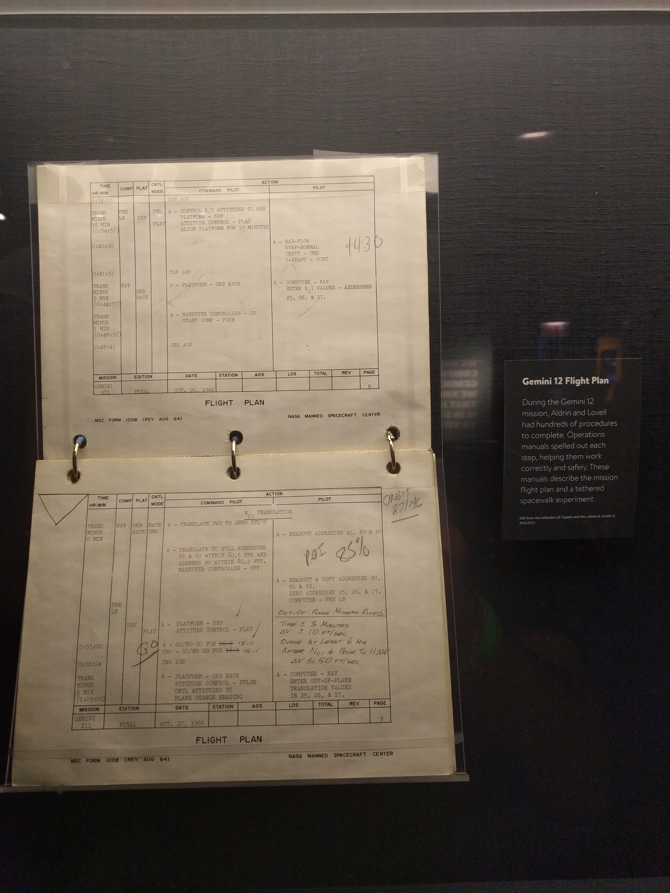
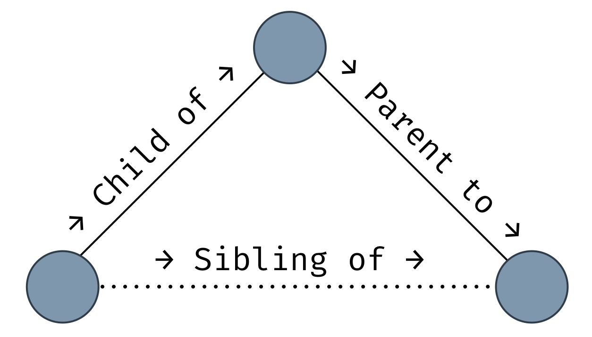
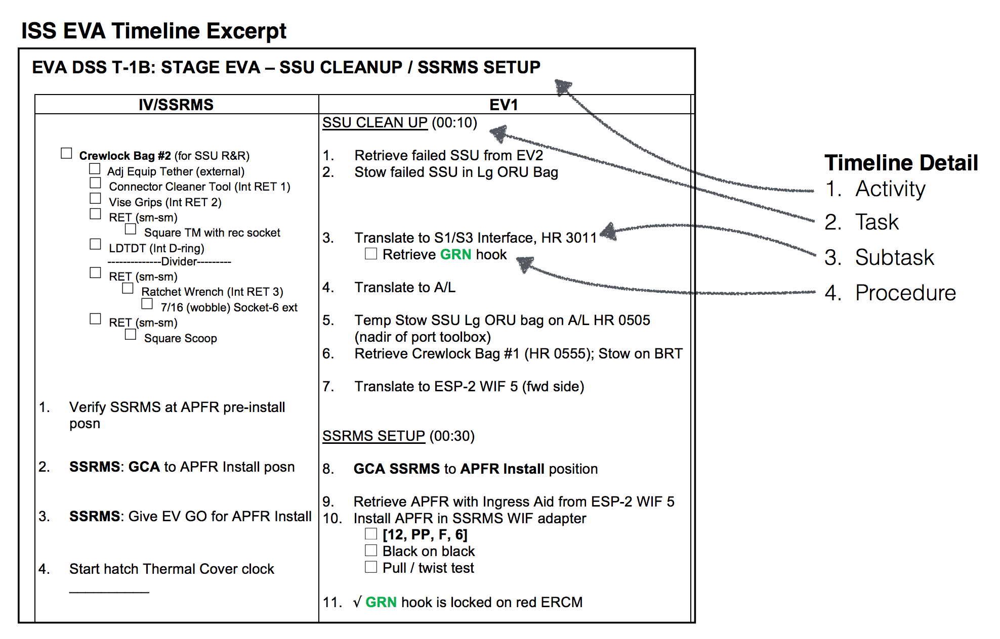
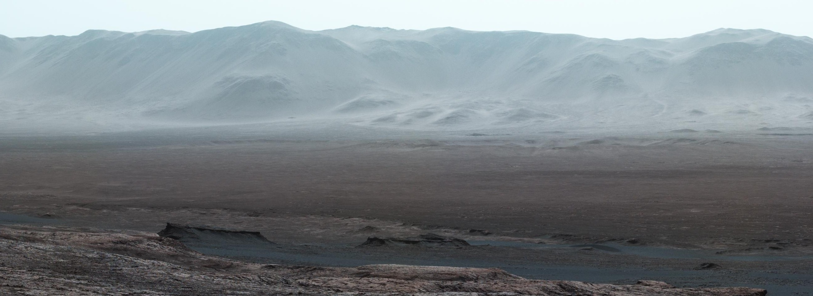
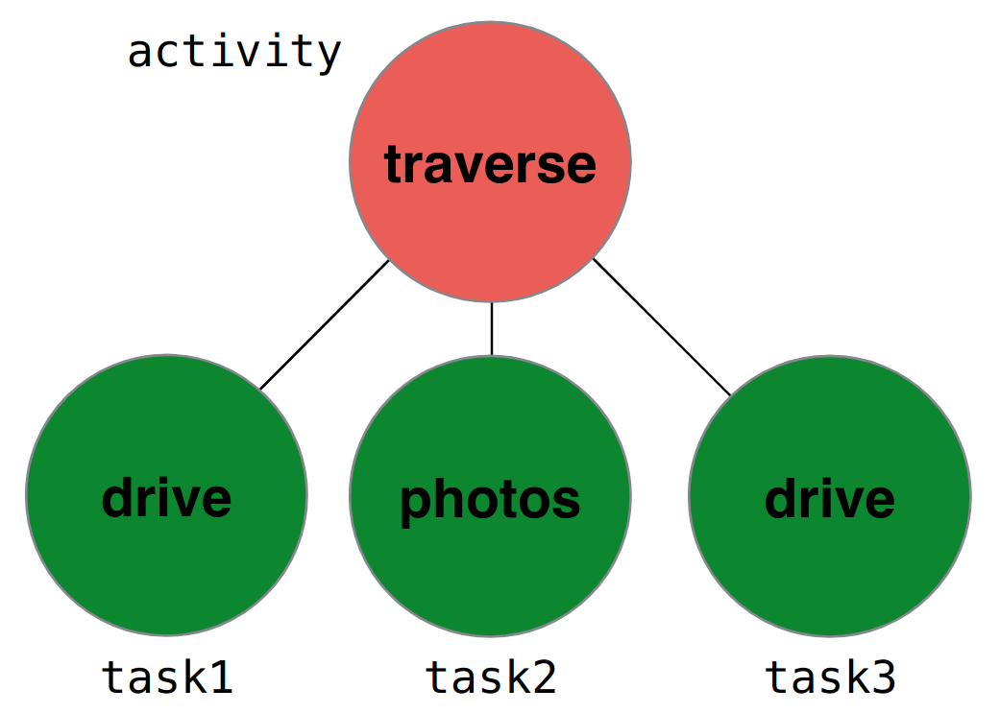

_This is part 3 of the Marvin series. Here’s [part 1](/posts/20180115-marvin-deep-spacewalks/) about why extravehicular activity (EVA) operations research matters and [part 2](/posts/20180204-marvin-apollo-timelines/) about the way timelines played out on the Moon._

If you don't remember from [last time](/posts/20180204-marvin-apollo-timelines/), exploration EVAs tend to run behind. If we want to plan better, it's worth looking at the way we currently describe timelines.

Take a look at the series of paper-based timelines below. Compare how the Mercury and Apollo programs were planned to modern ISS missions. There isn't appreciable difference in the structure of the plans. High-level outlines describe broad phases of the mission and low-level procedures provide minute-by-minute, atomic level details.



_This Gemini 12 flight plan has the same structure as today's EVA timelines. I took this picture at Adler Planetarium in Chicago._


_A page from the first EVA of Apollo 17. Note that there are both high level details ("EGRESS") with detailed procedures ("TURN ON 16 MM CAMERA") as insets. Miller et al,[^1] page 9, figure 2._


_The high level summary (top) and an example detailed task view (bottom) from the timeline for US EVA 22 on 9 July 2013. Astronauts Chris Cassidy and Luca Parmitano [began preparations to install a new ISS module](http://www.spaceflight101.net/iss-expedition-36-us-eva-22.html), the [Russian Multipurpose Laboratory Module](http://www.russianspaceweb.com/iss%5ffgb2.html) (Nauka or Нау́ка in Russian). They completed this 6 hour timeline almost perfectly on time. Take a look at the bottom of the first column of the detailed task view - you can see boxes where the intravehicular (IV) crew member - the astronaut inside the habitat - is expected to record the number of turns used to install bolts. This level of detail is not uncommon. Check out the [full timeline](https://www.nasa.gov/sites/default/files/files/US%5fEVA%5f22%5fTimeline.pdf) to see why it takes years to prepare for a single spacewalk. Also interesting to note: you can see that EV2 was asked to take a survey photo of the Alpha Magnetic Spectrometer (AMS). This EVA occurred two years after the AMS was launched and, at the time, did not yet need the repairs discussed [before](/posts/20180115-marvin-deep-spacewalks/) - this was just a survey to assess its health._

Using modern and historical timelines as inspiration, Matthew and I designed a hierarchical schema that encapsulates all the information from high level summaries to detailed, minute-by-minute procedures. (Though, as we'll see in a later post, it does not facilitate timeline calculations in and of itself.) As you move down in the hierarchy what it describes becomes more and more specific.


The hierarchy is as follows: Activity → Task → Subtask → Procedure. At the bottom, a Procedure represents an a single action, such as tightening a bolt. At the top, an Activity describes upwards of hours of mission time. We generalized the idea of an action the astronauts could take on EVA to something we called a Step, with a capital 'S' to distinguish it as a formal name for a defined data structure (from now on, capitalized versions of Step, Timeline, Activity, Task, Subtask, and Procedure represent the digital manifestations of their operational counterparts).



It's useful to apply familial terms to describe the relationship between elements in a tree like the Timeline. An Activity is the _parent_ to a Task, while a Task is a _child_ of an Activity. Two Tasks that belong to the same Activity are _siblings_.

We can translate ISS timelines to our data structure.



_This is how we translated ISS timelines to the schema we designed. For example, you can see that the Task of SSU CLEAN UP has seven Subtasks that belong to it, and the third Subtask has some procedural information that belongs to it. From Matthew's PhD thesis,[^1] page 138, figure 4.16._

[^1]: [Matthew's thesis](https://doi.org/10.13140/rg.2.2.17731.30248):<br>Miller, Matthew. (2017). Decision Support System Development for Human Extravehicular Activity. 10.13140/RG.2.2.17731.30248.

The naive approach to building a Timeline is relatively straightforward. I'm going to use [TypeScript](https://www.typescriptlang.org/) to exemplify how we built it.

A Step only needs a short description to identify it. An expected duration provides the timing data needed to do timeline calculations.

```typescript
class Step {
	description:      string; // a few word description
	expectedDuration: number; // the amount of time in minutes this Step should take
}
```

Additionally, a Step can have zero or more children. This is how we built parent-child relationships.

```typescript
class Step {
	description:      string;
	expectedDuration: number;
	children:         Step[]; // a list of other Steps
}
```

Specifically, an Activity can only have Task children.

```typescript
class Activity extends Step {
	// everything is the same except...
	children: Task[]; // a list of Tasks
}
```

Tasks and Subtasks look the same except for their type of children. Procedures do not have children.

## An Envisioned Martian Spacewalk

In order to get a sense for how our Timeline works and its strengths and weaknesses, let's imagine what one might look like when the first people are roving around doing science on Mars.



_Maybe this is what they'll see? The Curiosity Mars rover took [this amazing panorama](https://photojournal.jpl.nasa.gov/catalog/PIA22210) of Gale Crater in October 2017. Image copyright NASA/JPL._



_A small example timeline with child, parent, and sibling pointed out._

The Activity is the highest level of the Timeline, so let's create one first.

```typescript
let activity = new Activity();  // creates an Activity
activity.description = 'Traverse to Station 1';
activity.expectedDuration = 20; // time in minutes to reach the target location
```

An Activity can only have Task children. Let's create the Tasks that we expect astronauts to perform on the way to Station 1.

```typescript
let task1 = new Task();
task1.description = 'Drive to Checkpoint Alpha';
task1.expectedDuration = 14; // 14 minutes of drive time

let task2 = new Task();
task2.description = 'Photographic survey of outcrop at Alpha';
task2.expectedDuration= 2; // 2 minutes to take photos

let task3 = new Task();
task3.description = 'Finish drive to Station 1';
task3.expectedDuration = 4; // 4 minutes to finish the drive
```

Right now, we have four freefloating Steps: `activity`, `task1`, `task2`, and `task3`. We need to give them some structure. To do so, we're putting the Tasks in a list and making them the children of the Activity.

```typescript
activity.children = [task1, task2, task3];
```

Now that there is a relationship between all of the Steps so far, we can sketch what timeline calculations look like.

_Coming up next: math!_
