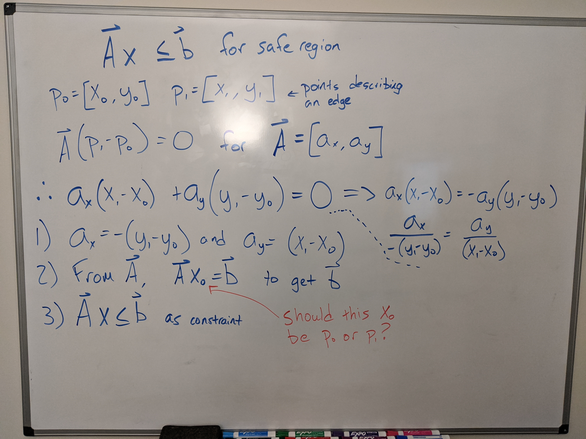

The weather in Cambridge, Massachusetts is a challenge if you don't have a car. It's only snowing if you're lucky. Usually you have freezing rain, sleet, and heavy winds that always seem to be headwinds no matter which direction you're walking. But if you do have a car, the traffic in Cambridge will make you want to ditch your car in the gridlock and just walk anyway. Last month, I was walking to class in freezing rain, my soaked jeans sticking to my legs, water dripping off my backpack, and... I still felt like I was making a good decision? That's what I was telling myself: lifelong learning (no matter how inconvenient) is a good decision.

My SO's career took us to Cambridge this past summer. Knowing we were going to move here, I applied to MIT's [Advanced Study Program](https://professional.mit.edu/programs/advanced-study-program) (ASP). The ASP is for professionals (or anyone else) who want to take classes on campus. You're charged full tuition for the course credit hours, but you receive full credit too. As an ASP student, you are effectively a "non-degree seeking" graduate student. Almost the whole course catalog is open to you so long as you have prior education or work experience that satisfies course prerequisites.

I applied, got accepted, and enrolled in [16.413 Principles of Autonomy and Decision Making](https://ocw.mit.edu/courses/aeronautics-and-astronautics/16-410-principles-of-autonomy-and-decision-making-fall-2010/) for the fall semester. What drew me to the course is the systematic study of techniques that I might be able to apply to EVA decision support system software like [Marvin](/posts/20180516-marvin-eva-timeline-breakdown/) at work.

I realize that this statement shouldn't surprise anyone, but a graduate level AeroAstro/CS course at MIT takes a _lot_ of work. Getting to class in the rain is absolutely a necessity when the final is around the corner.

_I keep a whiteboard in my office. This is basically how it looked all semester.  If you're curious, what's shown here is a derivation of linear edge constraints, which just entails determining if a point is on the "safe" side of a line. This was part of my final project of using mixed integer quadratic constraint programming to perform path planning in a two dimensional environment.[^1] Fun fact, there's definitely an error here beyond the one I'm asking about in the red marker._

The course itself consisted of two 90-minutes lectures each week, complemented by an hour long recitation and two optional office hours sessions. Just being on campus is a significant time commitment, especially when you have responsibilities from your full-time job too. I probably spent an average of 5 or 6 hours per homework assignment each weekend, with a few hours spread out each week catching up on readings.

It was totally worth it.

_[^1] A good intro to path planning with mixed integer programming: Schouwenaars, T., De Moor, B., Feron, E., & How, J. (2001). Mixed integer programming for multi-vehicle path planning. *2001 European Control Conference, ECC 2001*, (March 2014), 2603–2608. https://doi.org/10.23919/ecc.2001.7076321_