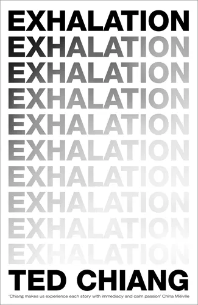

I don't read many anthologies. They're literary teases. Trying to read a collection of short stories feels like trying to binge watch random TV pilots - no matter the quality, I won't feel satisfied afterward.

Ted Chiang's _Exhalation_ was different for me. Each story lives in its own perfect little universe, isolated in space but connected to an overarching search for individual and collective identity. The characters and settings are diverse and compelling enough to keep interest, but they ultimately take a backseat to the real protagonist in each story, a question of how our identities are shaped by the forces in our lives. As I've said [before](/posts/20190224-book-review-end-of-eternity/), my favorite form of science fiction asks "what if?" as a means to question what is. _Exhalation_ falls squarely in this category.

**Some spoilers below**.

It's only natural to question your own identity. I'm getting married soon(!) and approaching my mid-thirties. I heard somewhere that your personality solidifies at age 35. Whether or not that's true, I've made a conscious effort to look at myself objectively and ask if I'm becoming the person I want to be. It's a trail blazed through choices, each one leading to an unknown and unknowable future. But I can imagine myself in that future looking back at myself now, and through that lens I find my closest approximation to an objective measure of my changing identity. I use it to ground each choice with a clear perspective on whether I will regret or find pride in it. Since I first took this view a few years ago, I've noticed a change for the better in my long-term decision making. My personality feels the same as it has ever been, but having this metric for assessing my identity has led me to seek opportunities I would have otherwise shirked.

The characters in a few of the stories in _Exhalation_ have their own versions of objective measures of identity. There is a time-traveling doorway in ancient Baghdad in "The Merchant and the Alchemist's Gate". Through it, generations uncover the mechanisms that shaped their identities through autovoyeuristic excursions to the past and future. In "Anxiety is the Dizziness of Freedom," parallel universes are real and people can talk to their "paraselves." Characters struggle with the question of the value of an individual choice if they know that their paraselves will choose every option across the multiverse.

In "The Truth of Fact, the Truth of Feeling," notions of internal and external truths are challenged as humanity is evolved through technology. In one half of the story, cultural identity and truth are challenged when European written language invades tribal Africa. A tribe pushes back on written records, choosing instead to lean on truth that reflects their identity. Likewise, a father in the future is at odds with implanted memory aids that allow for pixel perfect recall of any moment in an individual's life. His identity is challenged when he realizes his memories are false (in the "he remembers them wrong" sense, not the "implanted by aliens" sense), yet he's build a life around them for decades.

I doubt my sense of self has changed because of _Exhalation_, but I enjoyed its prompts to reflect on identity. Well written science fiction holds a special place in my heart. Humanity's story is not a progression of ever more bombastic sci-fi gadgets and space adventures. It's an evolution of a sense of collective self from the individual, to the family, the community, the state and so on. I love sci-fi that asks how our identity at every level will evolve as the species asserts a more prominent place in the universe. In this time of social distancing and isolation, I think that we're all getting to know ourselves a bit better. If you're looking for a book to keep you company, _Exhalation_ is the perfect companion for introspection.

