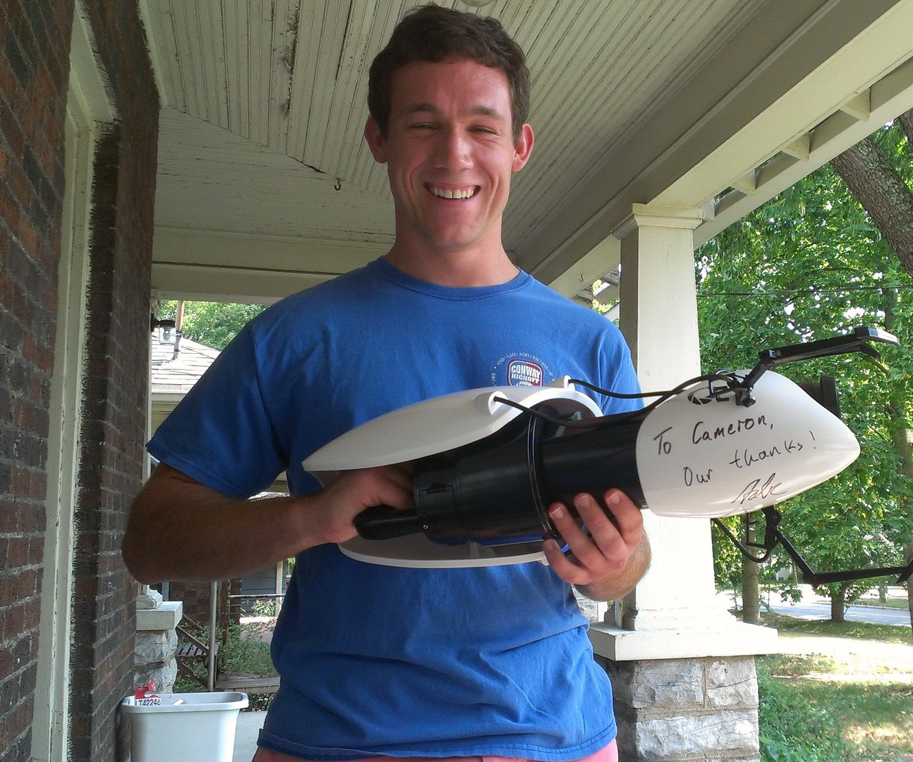

_This blog post is both for public consumption and it's being submitted as my
autobiographical essay assignment for 16.990 Leading Creative Teams in
Spring 2022. Because I've written the autobiography in chronological order with
a general philosophy of "show don't tell", I've included a [mapping](#lct) at
the bottom of this post that links the sections of this essay to the major
sections required by the assignment._

Last fall, I started graduate school in the [MIT Department of Aeronautics and
Astronautics](https://aeroastro.mit.edu/). I've been working on AI/autonomy in
the [MERS
lab](https://www.csail.mit.edu/research/model-based-embedded-and-robotics-systems-group).
More specifically, I've been researching the problem of multi-agent activity
planning and scheduling under time delay. These are the class of algorithms used
to help robots and humans coordinate their actions when they're having trouble
talking to each other.

I didn't get accepted to grad school on my first application, or my first
admissions cycle for that matter. This was my _third_ application to AeroAstro
and fourth application to a grad program at MIT. Since I finished undergrad in
2009, I received a masters in teaching right after college through the [New
Teacher Project](https://tntp.org/). During and after my teaching career right
after college, I applied to grad programs in astronomy and educational
technology. There were even a couple applications to graduate programs in
scientific writing, with me thinking that I wanted to be a science popularizer
like my hero, Carl Sagan. I was accepted to a couple programs and almost
enrolled, but I kept bailing at the last second after deciding that I had better
opportunities elsewhere. But this time it really happened. This opportunity is
too good to pass up. Twelve years after a bachelors in physics and astronomy,
ten years after a masters in teaching, eight years after I taught myself how to
code, and three years after I started [work at
NASA](/posts/20190615-getting-into-nasa/), I wake up every morning and keep
pinching myself that this career is real. 

I applied to AeroAstro because I want my career to define the future of space
exploration. It's the ultimate game. Studying astronomy gives you a longer
perspective on human events. From the long view, Apollo 11 happened last night.
The Wright brothers took flight a few hours before that. We're at the earliest
stages of becoming a multi-planetary species. I want to help us realize our
destiny in the solar system.

I get these waves of disbelief that this is real life more frequently than I'm
willing to admit. From the perspective of my 25 year old self, a high school
teacher with no engineering experience, it seems pretty improbable that I would
end up in a career that could impact the long-term direction of space
exploration. I haven't forgotten that I'm a self-taught programmer with no
formal engineering education, but here I am doing research and building systems
to help people _work better in space_.

The rest of this post will be an autobiography. I want to start at the beginning
of my career after college, when I was a high school teacher with a B- undergrad
GPA. I don't want anyone to read this and think it's an instruction manual.
Unless you're going into a career with predefined paths like law or medicine, it
doesn't make sense to try to make the same choices as someone and expect the
same results. Rather, I want to shed light on who I am now, how I think about
the future (and my future), and how that shapes my decision making.

Growing up, I could have articulated the same goals about
making humans a multi-planetary species without having any idea of how to make
them happen. A career was a blank space in my mind, in its place was a vague
notion that I wanted to make an impact on humanity's story. I grew up idolizing
Carl Sagan and Bill Nye. For a while, I wanted to be a science popularizer. I
wanted to be an astronomer. I wanted to be an academic. I wanted to write sci-fi
and inspire others. What I really wanted was to be an astronaut, but that dream
felt too big to pursue.

I had big dreams and loved science, but I didn't know what kind of career that
would lead me to after college.

## Undergrad

My career aspirations failed to cement during undergrad at Vanderbilt. I started
off as a biology major intending to become an academic in biological sciences,
but this was a path I mostly fell into because I took a lot of biology in high
school. I considered pursuing a pre-med path, but I never felt enthusiastic
about being a doctor. At the beginning of college I was in a work-study program
in lab with a zebrafish habitat. As the lowest ranking member of the lab, I
spent most of my time performing rote tasks like cleaning tanks and checking pH
and salinity levels. This was right around the time that podcasts were becoming
really popular. I used to listen to all sorts of science podcasts while I
worked, especially anything about space. I kept working in the lab over the
summer between my freshman and sophomore years because my family lived just a
few minutes away from the Vandy campus in Nashville. That summer, standing
between racks of zebrafish, listening to space podcasts and wiping down fish
tanks, I had an epiphany that I wanted to switch majors from biology to
astronomy. It's the science I loved most after all, and Vandy had an astronomy
department. I figured that even if I couldn't be an astronaut and go to space, I
would at least be happy as a professional astronomer studying space. A few weeks
later I met with the head of the astronomy department and changed my major.

I had my first brush with programming in my senior year. I was studying stellar
astrophysics, a mixed undergrad/grad level course about how stars work. Our
final project was to write code to simulate the conditions inside a star. The
final program would amount to iteratively solving seven equations for properties
like heat, pressure, density, rate of fusion reactions, etc, at expanding radii
and graphing the result. At the time, I had never written a line of code. I had
been doing all the math for my homework assignments in Excel. I initially
planned on doing the same for the final project, but it quickly became clear
that the complexity of the math and the level of accuracy required would make
Excel a bad choice.

About a month before the project was due, I decided to switch gears and use an
actual programming language for the project. I knew absolutely nothing about
programming languages. I picked C++ just because I thought it had a cool name. I
spent the next two weeks going through tutorials online to learn enough C++ to
do math in loops and write to CSV files. It took me two more weeks to get my
project working, but I did (with some help from my prof) and I got an A. I was
really proud of that A. In hindsight, maybe this should have been a sign that I
ought to take programming more seriously? Learning C++ on your own is no joke,
especially when you are an absolute beginner. I really enjoyed it too. But
unfortunately, I wouldn't open a code editor for almost another five years after
I turned in that project.

My experience diving into my first programming language is representative of the
strengths that consistently showed up in the assessments we did for LCT. It took
courage and a sense of intellectual adventure to go head first into the
assignment. This felt like it was tickling a different part of my brain than my
physics homework - building something was a wholly different challenge that gave
me a chance to exercise creative problem solving skills (also something that I
scored highly on in the assessments) in an entirely different way. But I missed
the strong signals of my strengths at the time. I was too focused on the
challenges at hand (trying to finish my undergrad and be an astronomer) to fully
realize how my strengths played into the assignment and what that meant for my
career. 

When I graduated, I wanted to be an astronomer but I was entirely unprepared to
be an academic. I spent so much time in college focused on having as much fun as
possible that I missed out on all the obvious preparation for grad school. I
barely studied for the GREs. I didn't attend academic conferences or network
with professors. I never even asked my advisor what I would need to do to study
astronomy in grad school. Sure I did some undergrad research and collected an
honor's thesis, but that wasn't enough.

For me, the biggest draw of being an astronomer was that I would have been able
to teach. I always loved the idea of teaching college classes and spending my
days geeking out over astronomy with students. When the last semester of college
rolled around and I realized I wasn't going to grad school right away, I started
considering getting experience teaching high school for a few years and then
pursuing a graduate degree later. On the advice of my dad and stepmom, both of
whom are school administrators and teacher, I enrolled in [The New Teacher
Project](https://tntp.org/) that spring and started attending job fairs for new
teachers. I was offered my first full-time job teaching science at a public high
school in Nashville soon after.

## Teaching Part 1 - Classroom Management

Teaching was the hardest job I've ever had or ever will have. I think most
teachers would agree with me, especially anyone who went straight into teaching
after college. I'll never forget the feeling of closing the classroom door
behind me for the first time, all alone, as a 22 year old in front of a class of
9th graders. I was suddenly faced with an immense weight of responsibility. I
was no longer a dependent of the educational system, I _was_ the educational
system. My attitude and my ability to perform, whether good or bad, now had an
impact on hundreds of lives besides my own. I was only just learning how to take
care of myself as an adult, yet now I was a parental figure for the hundred some
odd students that came through my classroom. It was overwhelming.

Then once I reconciled with the level of maturity and self-discipline required
to be a good teacher, the lifestyle of the career started to sink in and the
story got worse. The pay and the hours didn't match up, even with summers off.
Every morning was an early morning and every night was a late night. My days
ended long after the last bell rang. I was stuck on a Sisyphean climb up a
mountain of grading. Maybe a handful of times in my teaching career was I lucky
enough to leave right after school without creating a backlog of grading and
planning I would need to work extra hours later to clear out. There's basically
no such thing as overtime for teachers, making most of those hours spent
planning for and chaperoning after school events acts of charity[^1].

The first challenge I had as a teacher was classroom management. This goes hand
in hand with the notion of finding a teaching personality. I didn't understand
my [identity](/posts/20200424-book-review-exhalation/) yet. I still felt like a
student. Was I still a college student, only looking out for myself? Was
teaching going to be my career? Was I taking a detour in my career as a
scientist? Or was there another career out there for me? I was all of these timelines,
shifting between them moment to moment.

The first year was the hardest. I had no classroom management skills. It's
unrealistic to expect that every single student in every single class is
engaged, but I struggled to keep enough order such that the students who were
eager to learn even could. It was probably the worst kind of crash course a
teacher could have, but by the second year I started to understand what mix of
classroom rules and teaching persona I could employ to could create a healthy
learning environment. In my fourth year I felt like my classroom was finally
running like a well-oiled machine.

Two major factors contributed most of the impact to
improving my classroom management: (1) I developed a teacher persona that worked
for me, and (2) I learned to delegate.

I started off as with a facade of being tough. These students came from rough
backgrounds and I was very young and very fresh. I was afraid they would walk
all over me if I didn't seem tough. So I rarely smiled and feigned anger to get
their attention. This was a very poor choice.

The students saw right through me. They immediately knew I was fake and hardly
listened to a word I said. My classroom was a mess until I learned to use my
true personality to shape my appearance in the classroom. In reality, I'm a
nerd. I geek out about science and love making jokes.

The New Teacher Project, much like Teach for America, included a masters in
education, which was required for the teaching certification. Ours was
administered through Belmont University. Our first classes served as venting
sessions. We met after school on Mondays and Wednesday. Our professors let us
spend most of our time talking about the struggles we faced. My favorite part
was the pre-class venting sessions we had over sushi, burgers, and drinks at the
restaurants near campus.

Teaching was more rewarding than anything else I have ever done. All the
struggle and sleep deprivation were worth it because I got paid to do what I
loved - geeking out with students about science. I was explicit that my goal
wasn't to turn all of my students into professional scientists (though it has
been gratifying to see that a few of them have!) - I just wanted my students to
enjoy science! Maybe then science would feel accessible. At the very least,
making the world a little more understandable makes it a better place.

I found that my best teaching persona is just being myself. At some point in
that first year of teaching, I started opening every class with the [Astronomy
Picture of the Day](https://apod.nasa.gov/apod/astropix.html) (APOD). Students
would walk in to my classroom with the lights off and the projector on. The
first five or ten minutes would consist of a discussion about some neat
astronomy image. No quizzes, no grades. Just a moment to relax and appreciate
science. Each year usually started off where I would be the only one talking
about each image, but by the second semester, the students learned enough that
it was usually a group discussion. A few classes got bored of APOD so they asked
for something different. I wound up doing the Animal Picture of the Day a few
times (not a website, just me finding weird animals on Wikipedia) and sometimes
we just talked about science stories in the news.

Whole class lectures were fine, but I mostly enjoyed the small group moments. I
loved picking apart the preconceptions students held about the way the world
works in order to help them reassemble a more accurate picture. An intuition
about science can make all the difference. Of course the math and equations are
the ultimate source of truth, but students need robust mental models to guide
their thinking.

Labs and hands on learning were my favorite. Nothing beats getting dirty and
collecting numbers. Physics teachers tend to get creative about their labs. I
enjoyed taking taking classes outside as much as possible. Football fields are
great for running physics experiments. We did egg drops off the stands and speed
of sound tests across the field. We went to a playground once to talk about
conservation of energy while swinging and climbing on the monkey bars. My
students took over the school hallways with catapults and race courses for
matchbox cars. I helped design an interdisciplinary science class where the
students buried dead chickens to learn about forensic science. We took students
to water and sewage treatment plants to learn about water chemistry. We went to
an observatory to learn about solar physics. One year we were lucky to have a
partnership with a nearby university and our students got to do chemistry in
their labs.

In the words of [Ms.
Frizzle](https://magicschoolbus.fandom.com/wiki/Professor_Valerie_Frizzle,_PhD),
I "got messy" a few times too. And by that I mean I injured myself doing
science. 

_My teaching idol._

I taught freshman physical science[^2] in my first year of teaching. Students
were learning about chemical reactions involving acids and bases, so I wanted to
start class with this fun demonstration where you drop a small strip of
magnesium in a test tube with hydrochloric acid and it produces hydrogen gas. If
you hold another test tube upside down over the reaction (or a
[balloon](https://www.youtube.com/watch?v=Sitwme77xwA)), you can capture the
hydrogen gas and ignite it, producing a neat "whoop!" sound with a quick flame
(I took every opportunity to burn things in my chemistry classes).

As this was my first year of teaching, my knowledge of the chemistry supply
closet was incomplete so I asked the other chemistry teacher to help me grab the
hydrochloric acid. He handed me a glass bottle and neglected to tell me that it
was our concentrated 12 M hydrochloric acid, and, being in a hurry because
everything was always crazy that first year, I neglected to ask about the
concentration.

At high concentrations under STP, hydrochloric acid visibly off-gases enough
that it looks like a witches brew. I don't know how I didn't have an alarm in my
head blaring 🚨STOP YOU IDIOT THIS IS DANGEROUS🚨 when I poured a few
milliliters into a test tube and saw vapors forming. I must have been distracted
by my usual classroom management issues. So there I was, standing behind a lab
bench in front of a class of freshmen with hydrochloric acid vapors swirling
under my face. I had just dropped the magnesium into the test tube when I was
seized with an awful burning sensation in my chest. I was drowning in fire. I
started heaving and coughing, and of course I dropped the glass test tube, which
shattered and sent even more hydrochloric acid vapors into the air. I thought I
was dying. I didn't even realize what had happened at first. I turned my head up
trying to get away from whatever evil was tearing through my lungs.

My students were understandably alarmed. My classroom management skills were so
bad at that point that, to be honest, I had doubts that my students actually
cared about me as a human being. I caught enough breath to start sputtering the
name of the other chemistry teacher and the word "clinic." To my surprise, the
two students closest to the door rushed out and got both of them, while the rest
backed their desks as far away from me as they could.

A few moments later the front of my classroom was covered in baking soda and I
was breathing again. My chest ached. I already sounded hoarse. The nurse said I
was probably fine but I should go see a doctor. I gathered all my students back
and calmed them down. I was fine, I told them. What had just happened was scary,
to be sure, but that doesn't mean we shouldn't try the demonstration again. The
other chemistry teacher diluted the hydrochloric acid for me, and, eager to not
let a small setback like acid burned lungs prevent science from happening, I
dissolved some magnesium and blew up the resulting hydrogen gas. I remember my
students asking me "why are you trying it again!?" after the whole ordeal, which
was a very reasonable question. I told them that mistakes are a great way to
learn. You shouldn't let getting something wrong the first time dissuade you
from improving and trying again.

As soon as that class was over, a substitute teacher took over for me and I
drove straight to my doctor's office.

I had my first brush with grad school rejections in my second year of teaching.
Life was hard as a new teacher. I still dreamt of life as an astronomer. Nothing
had changed about the quality of my applications since I graduated - I knew
nothing about the networking and preparation required for grad school. I fired
off applications to seven or so schools in a shotgun approach and got rejected
from all of them. On a whim, I even sent an application to the [MIT Graduate
Program in Science Writing](https://sciwrite.mit.edu/). I still had dreams of
becoming the next Carl Sagan. I thought I might have a chance because I had a
really high GRE writing score and a lot of experience writing about science for
my classes (I had just finished writing a 30-page mini textbook on astronomy for
one of my interdisciplinary science classes). Of course, this application also
got rejected. This would not be the last rejection letter I'd get from MIT.

This feels like a low point. My big plans for a delayed start as an astronomy
grad student completely collapsed. I had no idea what to do next. I was starting
to love teaching but I still couldn't quite imagine being a teacher for the rest
of my life. I wanted new problems to solve and new skills to learn. I started
thinking about starting fresh in another career, like maybe the military. But
underneath all that frustration and disappointment was a sense of freedom too. I
could be whatever I wanted to be. I had no real responsibilities outside work.
No strings, no expectations. I could wing it and see where that led. I soon got
the chance.

## Teacing Part 2 - Thinking with Portals

A few months later, between my second and third years of teaching, I realized I
had a problem with my physics labs. I had the luxury of teaching a class without
a standardized exam, which meant I had more freedom in the topics we covered. I
liked being able to react to student interest. The school had a small budget for
lab equipment and the ordering process took almost a whole school year. As such,
I often felt frustrated that I didn't have the supplies for all the labs I
wanted when I wanted them. I had some success getting creative cobbling together
labs from the equipment I could find, and sometimes I spent my own money to buy
the equipment I needed, but I knew we could do better. What I really needed was
time to requisition a closet full of physics equipment. Given it wasn't going to
appear overnight, I started to think of alternatives.

A physics simulator came to mind first. Assuming everyone in the class had
access to a half-decent computer, virtual labs in a simulator could be cheap,
easy, and flexible. [Physlet](https://physlets.org/pp/start.html)-style apps had
come in handy for a number of lessons. My favorites came from Colorado
University's [PhET](https://phet.colorado.edu/). The problem with them is that
they're all generally made to demonstrate a single concept. I wanted a general
purpose simulator. I play a lot of video games. I realized that cheap and
readily available video game physics engines had potential to be the flexible
physics lab tool I needed. It wasn't long until I landed on
[_Portal_](https://en.wikipedia.org/wiki/Portal_(video_game)) as my physics lab
environment of choice. In _Portal_, players explicitly solve physics puzzles and
the game has a general science-y motif.

<iframe width="560" height="315" src="https://www.youtube.com/embed/PRXRFibYpnI" frameborder="0" allow="accelerometer; autoplay; clipboard-write; encrypted-media; gyroscope; picture-in-picture" allowfullscreen></iframe>

_A demo of_ Portal.

I needed a proof of concept lesson. I spent the next few days poring over the
levels in _Portal_, looking for any environments that could be turned into a
kinematics lab. I recognized that the tiles in the game were going to be the key
to making the labs work. If you watch the trailer above, you'll see that each
room is generally covered in square tiles. Being a standard size and shape, they
make for a perfect unit of distance. That opened up a whole range of experiments
in kinematics and mechanics.

At the same time, I needed to prove to myself that _Portal's_ [Source
Engine](https://en.wikipedia.org/wiki/Source_(game_engine)) mirrored real-world
physics well enough to be useful. The physics didn't need to be perfect, just
internally consistent and modeled close enough to real physics to be
recognizable. I started running my own experiments. Remember, I had no idea how
to code yet. I didn't know how to open the game console and run commands to pull
measurements. Rather, I took the physicist approach. I staged experiments in the
game, recorded videos, and used physics tracking software to analyze the motion
of cubes. I tracked them falling, sliding, and colliding. Lo and behold, the
Source Engine modeled realistic-ish physics.

I sketched out my first unit of lesson plans about projectile motion. In it, I
assumed that every student would have a laptop and a copy of the game to play
independently. We had a cart of laptops at the school that met _Portal_'s
minimum system requirements, so I wasn't worried about that. But there was the
other issue of getting enough copies of _Portal_ for a whole class. I had an
idea to ask the Internet for help. [Valve
Software](https://www.valvesoftware.com/en/), the makers of _Portal_, frequently
gave out free copies of the game. I bet that a bunch of gamers out there had an
extra copy of _Portal_ sitting around and maybe, I hoped, they would be willing
to donate them to my class. I shared my lesson on reddit (on
[r/portal](https://www.reddit.com/r/Portal/comments/j87zu/rportal_this_inner_city_high_school_physics/)
and
[r/gaming](https://www.reddit.com/r/gaming/comments/j88ft/rgaming_this_inner_city_high_school_physics/))
and asked for game donations.

My plan worked. I netted about 20 copies of Portal over the next few days. And
then, to my surprise, I found this message in my reddit inbox.

> Title: hi from Valve
>
> I just saw your post about using Portal in your physics class, and we'd love
> to help you out. We're actually investigating facilitating exactly this with
> Portal 2, and we'd love to talk about what you're doing and what you'd like to
> do.
>
> Email me at [name redacted]@valvesoftware.com, please, and we'll talk.

I idolized Valve Software. The _Half-Life_ series, the _Portal_ series,
_Counter-Strike_, and _Team Fortress 2_ were some of my all-time favorite games.
When I got an email from an employee there, it felt like a celebrity wanted to
meet me. I couldn't believe it. It felt like validation that I found a problem
to solve that other people cared about. I emailed them immediately and that
started a relationship that would fundamentally alter the arc of my career.

With hindsight, it's easy to ascribe meaning to small events like this. Now, ten
years later, I can make grandiose claims like "fundamentally alter the arc of my
career" because I can clearly trace the cause and effect relationships between
the series of events between this one and where I am now. But the truth is that
at the time I had no idea what this meant or what was going to happen. I was
just excited to see where it led. I remember thinking that it could be something
big or it could be nothing at all. And I was okay with that. I used to go on
runs after work in the West End neighborhood of Nashville where I lived. The
quiet little voice in the back of my head wasn't so quiet. It was a record on
repeat telling me that _I could be whatever I wanted to be_. The mantra had a
weird intonation though. I can't describe it other than to say it emphasized
that future. I had heard this phrase so many times growing up. My loving and
supportive parents always told me so. My teachers told me so. But I think this
might have been the first moment in my adult life where the idea of a
self-deterministic future took hold in with full effect. I saw a life ahead of
me. I saw hard work. I saw goals being accomplished. It was all the timelines of
all the futures I could have all at once. It's a great feeling being young and
seeing your whole life in front of you. Even though I won't be young forever, I
hope I never lose it.

Back to the story at hand, this one email I got from Valve meant I already came
out ahead in the _Portal_ experiment.

After a few back-and-forths, I was put in touch with Valve's new director of
education, Leslie Redd. The first thing that Leslie told me was that Valve could
hook up my class with as many copies of the game we needed, but the catch was
they wanted me to use the newly released _Portal 2_ instead. This wasn't really
a catch because _Portal 2_ included a an easy-to-use level editor. It would be a
huge upgrade to my lessons, which I had originally discounted because _Portal 2_
was a new, full-price game. I began writing a series of lesson plans that would
take advantage of the _Portal 2_ level editor. The level editor would let me
reframe my lessons from "find cool physics in _Portal_ to study" to "build
physics experiments in _Portal_ and predict the results." I wrote lessons where
students would build contraptions and take measurements in the game world. This
would let me task my students with challenges like determining exactly when and
by how much the physics in the game diverged from real-life physics (ignoring
the fact that portals don't exist of course).

_Demonstrating the use of the_ Portal 2 _level editor in the fall of 2012, a
year after my first contact with Valve. Credit: Jeff Unay_

In these first conversations with Leslie I learned that Valve wanted to support
educators but they didn't know how to do it. They were excited to meet teachers
like me who might be able to foster learning communities around their games. I
learned that they had a new website in the works called Teach with Portals
([teachwithportals.com](http://teachwithportals.com) seems to have been given
over to a group called foundry10 I'm not familiar with, but they're still
hosting my [physics
lessons](http://www.foundry10.org/programs/games-and-learning/portal-2)!). They
wanted teachers to share lesson plans that starred Valve games. I loved it. I
was super proud to be a part of the effort to make video games a more mainstream
teaching tool.

_My classroom in the fall of 2012. I'm with some of my 11th grade physics
students working on their experiments in_ Portal 2. _Credit: Jeff Unay_

Valve's grand vision for education needed teacher evangelists with a ton of
energy and creativity. I recognized an opportunity. They needed me. So, six
months after making contact with Valve I drafted this email.

> Hi Leslie,
>
> I hope you had a fantastic holiday season. I used my time away from work to
> gain some perspective on my career and the trajectory I think it should take.
> I came to the conclusion that I'd like to pursue a career with Valve.
>
> If Valve is serious about education, it will need people with an intuitive
> understanding of the way education, physics, and video games should interact
> and interplay. In light of my background in physics and education, I would be
> a leading asset in not only designing the next generation of virtual physics
> simulators, but also in promoting and distributing these simulators to
> educators. After almost three years of teaching, I know what teachers need to
> improve student learning. I understand the importance of feasible and
> effective classroom tools. I know how to maximize classroom resources to fit
> any grade level and ability. Having grown up in a family of educators, I am
> aware of the type of initiatives school districts are willing to support. I
> also speak the language of education, which allows me to successfully
> communicate and sell the utility of tools like the Portal 2 Puzzle Creator to
> educators.
>
> [A few more paragraphs on what I would do at Valve and my goals for the
> effort]
>
> Thank you Leslie! I really appreciate the opportunity to be involved in this
> exciting project. My experience with Valve so far has been nothing less than
> stellar, especially as a long time fan of your games. I hope my relationship
> with Valve is only beginning.
>
> Sincerely,
>
> Cameron

It's hard to know for sure, but I think this was the first time that I took a
long view on my choices at hand. I spent a week with this letter, tweaking every
word and debating whether or not I should send it. I wasn't worried so much
about being rejected, I was just anxious about putting myself out there. I meant
every word in that letter. What if I read the situation wrong and got
embarrassed by this whole episode?

I used to go on runs after school through my neighborhood in Nashville. I always
daydream when I run. Two scenes kept recurring during those Nashville runs. In
one, I imagined picking up a newspaper and reading that a newly selected
astronaut started off their career as a high school teacher. To my surprise, it
sounded possible. In the other scene, I imagined myself as a 90 year old man
sitting in a rocking chair. 90 year old me would be reminiscing about their life
and me now at this exact moment. What were they feeling? Was it regret?
Disappointment? Pride? The answer was obvious. I sent the letter.

I got a response from Leslie a few days later (I've been searching for that
email but I think it's gone - I must have sent the letter with my school email
address that I lost access to years ago). She said she agreed with me, and
although a full-time job wasn't possible, Valve could start covering my time
spent on lesson plans and such as a part-time consultant. Looking back, it's
weird that I don't remember the moment of receiving Leslie's email very well. I
was so nervous and stressed. I was initially disappointed about full-time but I
came to realize that this was still a tremendous success. Here I was, some
nobody teacher, heads down in their classroom, and I found a way to claw up and
out to the bigger world outside with a group of people that _mattered_.

_Valve sent me a portal gun signed by Valve founder and Internet celebrity [Gabe
Newell](https://en.wikipedia.org/wiki/Gabe%5FNewell). Here I am showing it off
the day I received it in July of 2012. It's easily the coolest piece of video
game memorabilia I own._

It really pains me to describe how hard I tried to leave teaching. It sounds so
calloused, like I didn't care about the kids. Like I was just in it for me and I
wanted get out as quickly as possible. It's obviously true that I wanted to
change careers, but I've left out a lot of good times at school. The more time I
spent teaching the more I loved it. I still think about my classes a lot. I go
over conversations we had. I kick myself over all the mistakes I made in the
classroom, especially early on. What I really hate is that I was part of a
system where the teacher turnover rate is upwards of 40% year-to-year and I'm
one of the 40%. I am comforted by the fact that I worked hard to make the school
system better for the four years I was in it, but it's hard not to think of ways
I could have done more. I've held onto the dream that I'll retire and go back to
teaching at the end of my career. It only makes sense to bookend my career with
teaching.

Before I get back to the main story, I want to get on my soapbox for a moment
about teacher salaries. Holy cow, they should be tripled.

Tripling teacher pay would immediately make teaching a much more competitive
career. Teachers could be held to much higher standards because they would know
that there is a line of applicants waiting for their high paying jobs. You could
raise the requirements for teacher training while still reducing attrition
rates. The educational system would be transformed overnight, the beneficial
effects of which would ripple outward through all aspects of the American
system.

The further into my teaching career I got, the more I was on the fence about
leaving. It was turning into a career I could enjoy long term. But the mix of
long hours, stressful work environment, lack of respect, and very low pay
compared to my equally educated peers pushed me over the edge. Tripling my
compensation would have drastically changed the calculus in my mind and there's
a high likelihood I would have turned into a teacher for life.

My participation in Teach with Portals ramped up quickly after the letter. Over
the next few months, I wound up writing a lot more lessons and creating a blog,
[Physics with Portals](https://physicswithportals.com), where I shared video
demonstrations of the physics lessons.

<iframe width="560" height="315" src="https://www.youtube.com/embed/I12iKDxxcY4" frameborder="0" allow="accelerometer; autoplay; clipboard-write; encrypted-media; gyroscope; picture-in-picture" allowfullscreen></iframe>

Despite all the effort of collecting copies of _Portal_, developing lessons,
getting support from my administrators, and working with Valve, we still had IT
problems getting _Portal 2_ installed on the school's laptops. Numerous Internet
and software admin policies frustrated my efforts to implement a whole class
lesson with _Portal 2_. The school was subject to district policies, and
district policies were slow to change. As a means of circumventing the issues
and getting student feedback, I wound up bringing in my own desktop to school to
do some one-on-one trial lessons with my physics students during lunch and after
school. By the end of my third year of teaching, 10 months after first
contacting Valve, I still had not yet actually taught physics with _Portal_ to
an entire classroom.

That summer, I learned about a physics teacher job opening at a nearby charter
high school, [LEAD
Academy](https://leadpublicschools.org/schools/lead-academy/). This was
intriguing because unlike the public school where I started my teaching career,
the charter school had its own IT department and laptop policies. They also had
a classroom cart of new MacBook Pros. In my interview with the principal, I
explained everything that had happened so far with _Portal_ and Valve and laid
out my plans for teaching a semester of physics with the game. She was on-board
and offered me the job. All of a sudden, all of pieces fell into place for a
semester of actually teaching physics with _Portal_.

Valve invited me to visit their offices in Bellevue, Washington that summer too.
I got to meet other educators teaching with _Portal 2_ and discuss the potential
for video games in education with game designers at Valve. I also had a fateful
meeting with Valve's in-house [videographers and
documentarians](https://en.wikipedia.org/wiki/Free%5Fto%5FPlay%5F(film)), not
realizing they were going to become a fixture in my classroom in the next school
year.

_In the main lobby of the Valve offices in July of 2012. I'm on the right.
Leslie Redd and Yasser Malaika, a designer at Valve, are on the left._

When I returned home, I learned that they wanted to make a short documentary
about my classroom. I shared the news with my new principal and we set the
wheels in motion to allow a film crew to visit my physics classes. The pictures
I've been sharing of my classroom all came from the documentary effort. I feel I
need to spoil the ending of this part of the story. Before any of you reading
this go off to try to find the documentary, you should know that it was never
finished and nothing was ever released except for the few pictures and videos
included here.

Leslie and Jeff Unay, one of the filmmakers at Valve I met, started flying out
to Nashville to visit my classroom and meet my students in the fall of 2012.
They decided to spotlight two students in the film. My class and my crazy ideas
with _Portal_ were to become something of a backdrop in showing what life is
like for charter school students in inner-city Nashville. They collected about
80 hours of footage over three trips. In my estimation, only a third of the
footage came from my classroom. The majority of the filming focused on the two
spotlight students and the rest of the class. It's easy to see why. These were
really special kids. This school had lottery admissions meaning that any student
in the district could apply. No academic requirements were necessary except the
understanding that enrolled students were to always put forth 100% effort to
their academics. The school didn't care if applicants were smart - they just
wanted them to always try their best.

Starring in a documentary was strange. I enjoyed the attention and the company.
As a teacher, you spend so much time with kids that it can be a nice change of
pace to have other adults in your classroom. I felt comfortable in front of the
camera. My mom was a journalist and anchorwoman. I grew up around cameras.
Talking to one felt natural, as did having them film my classroom. It was also a
good exercise as a teacher reviewing footage of my techniques. In the video
below, you can watch the raw footage from a classroom discussion I led about
conservation of momentum.

<iframe width="560" height="315" src="https://www.youtube.com/embed/qK4JyVAHh8o" title="YouTube video player" frameborder="0" allow="accelerometer; autoplay; clipboard-write; encrypted-media; gyroscope; picture-in-picture" allowfullscreen></iframe>

The documentary also gave me a microphone to share my views on the universe.
Here's a short piece Jeff put together where I talk about my favorite hobby at
that time, astrophotography.

<iframe width="560" height="315" src="https://www.youtube.com/embed/jfzcG5yh4wk" title="YouTube video player" frameborder="0" allow="accelerometer; autoplay; clipboard-write; encrypted-media; gyroscope; picture-in-picture" allowfullscreen></iframe>

_I still wanted to be Carl Sagan, sharing a sense of wonder about the Universe._

I haven't gone into much depth here about my classroom techniques and the
physics lessons themselves because I wrote two pieces about the effort (and this
story is already long enough!). The [LEARNing
Landscapes](https://www.learninglandscapes.ca/index.php/learnland/article/view/Teaching-With-Portals-the-Intersection-of-Video-Games-and-Physics-Education)[^3]
article describes the lessons themselves. The chapter I wrote for [Teacher
Pioneers](https://press.etc.cmu.edu/index.php/product/teacher-pioneers/)[^4]
gives my advice to teachers who want to try their own crazy lessons.

The _Portal_ saga continued for a few months after the fall semester. Leslie and
I gave a number of presentations at educational technology conferences with a
few other teachers in the Teach with Portals effort. The communications about
the documentary with Leslie and Jeff continued frequently at first but they
cooled off and eventually stopped altogether. We at the school assumed that was
because Valve was heads down working on the doc, but now we know it's because
the documentary was eventually canceled. I can only speculate as to exactly what
happened, but from the outside it seems clear that Valve's priorities shifted
away from education. When I learned that Leslie lost her position at Valve
sometime that spring, I knew that the documentary and the physics with _Portal_
saga were over.

Behind all of this excitement with Valve and the documentary, I was desperate
for a change. I was dating a girl who lived in Santa Cruz, California. I wanted
to get out of Nashville. I spent most of my teaching career living with my
college buddies. I was still going to the same parties and crawling the same
bars on the weekends. I needed a change. I hadn't let go of the idea of grad
school. I had made a name for myself through the media coverage of the Teach
with Portals effort and all the conferences. My name and my ideas showed up in
all sorts of [articles](https://physicswithportals.com/in-the-media/). I had
teachers from all over the world reaching out to learn how they could apply
similar teaching methods in their classrooms. I decided I wanted to study and
build educational video games. I realized that my experience with _Portal_ would
create a convincing case in an application to a graduate programs in educational
technology. I used the publicity we were getting to start networking with
professors who were researching educational technologies. I made my second
attempt at graduate school that year. I applied to the educational technology
programs at my alma mater Vanderbilt, Arizona State, and UC Santa Cruz. I wound
up getting accepted to ASU and UC Santa Cruz.

I believe I had already accepted the invitation to attend UC Santa Cruz when I
would have another phone call with Leslie that would change my life.

I got a call from her when I was grocery shopping. This was after she had left
Valve, probably around April of 2013. She spoke even more excitedly than usual.
I had to stop shopping and walk over to a counter where there was a pen and some
scrap paper. I started taking notes as she was telling me about this new
business she was starting and wanted me to come with her. It was an educational
technology company in Seattle. No name yet. She was the first employee, I would
be the second. There was already enough angel funding for a year-ish of runway
with a handful of employees. The business idea wasn't clear, but it would have
something to do with helping educators find useful teaching resources on the
Internet. I don't know if she used the phrase "iTunes for education" on the
phone, but eventually that's how we would explain it.

## My First Startup Experience - LearnBIG

I had no experience in the business world. No clue what it meant to work any job
besides teaching. But I realized how unique this opportunity was. Very few
people get a chance to start a business about their passion. I recognized that
this was the kind of opportunity I would have desperately wanted to find _after_
going to grad school, so I figured why not skip grad school for now? Leslie's
passion was infectious, and after tangentially working with her for two years, I
was excited to dive into a project with her full-time. Two days after the school
year ended, I found myself on a flight to Seattle with no return ticket. Leslie
let me crash in her family's guest bedroom and we got to work.

This startup turned into
[LearnBIG](https://www.crunchbase.com/organization/learnbig). I started as the
Director of Content. We quickly landed on the idea of a building a community of
educators around online education. My immediate goals were to curate as much
online educational content as possible as quickly as possible. This was the
start of the summer, so we hired a team of interns to scour the Internet and
build a comprehensive database. In the meantime, we hired a local contractor to
build our website. We had big plans with discussion boards, playlists, rating
systems, comments, and personalized suggestions. We wanted an experience that
could support a vibrant, active community. Our early conversations about what
success meant to us were phrased in terms of monthly active users. If we could
tell a story around a growing community, more funding would surely follow. At
some point, with enough users, we would even _try to monetize_ (I actually don't
remember what our monetization plans were).

_The original LearnBIG home page. I'll take credit for the all caps "BIG" in our
logo. I thought it made sense and I still think it looks good._

A few months later, we launched the website with [a lot of
fanfare](https://www.usatoday.com/story/tech/2013/09/04/learnbig-digital-ratings-site/2760331/)
and watched as our user engagement numbers were... in the single digits. Of our
whole collection of educational resources, only two entries ever got a rating
from users ever. It was an obvious failure from about the second day after
launch. Basically by the end of the first week, we had basically abandoned the
website and started a pivot to find a new product idea.

In hindsight, we made a lot of poor decisions. I feel conflicted about my role.
I take some responsibility, but the fact of the matter is I didn't know better.
My whole business experience amounted to two months of scrambling in a startup
and skimming [_The Lean Startup_](http://theleanstartup.com/) over a weekend.
Our key mistake was simply that we invested a huge portion of our capital in an
product without performing any actual market research. "If you build it, they
will come" worked in _Field of Dreams_, but it doesn't work in business. No one
was asking for our product, so no one ever used it.

That being said, I wouldn't trade the experience of building the first LearnBIG
website for the world. It is how I became an engineer. @@awk@@

A couple weeks into the process of curating the database of educational
resources, a thought occurred to me - I was working on a website, but I had no
idea how websites worked. I reminisced about my astronomy project where I
simulated a star with C++. I had more free time now that I wasn't teaching (yes,
teacher's hours are much worse than even the most devoted startup founder's.
Seriously, teachers need their salaries tripled), so I asked the engineers in
the office for some direction on learning how to code. They pointed me to
[_Think Python_](https://greenteapress.com/wp/think-python/), a free textbook on
the fundamentals of coding with Python. And I used our burgeoning database to
find an [MIT OpenCourseWare](https://ocw.mit.edu/index.htm) course on Python for
complete beginners.

Learning how to code replaced my usual after work hobby of video games. I
obsessed over the programming problems in the textbook and classes. My teacher
instincts kicked in. Instead of solely consuming problem sets, I started to
write my own challenges. I would riff off the problems by adding new twists.
These usually took the form of, "we need to use _thing A_ and _thing B_ for this
problem, but if I can figure out _thing C_, then I should be able to solve this
other category of problems." It started simple, like figuring out different math
operators or having fun with recursion. But it quickly grew more complex to the
point where I was building 2D physics simulators. Once I started to get a feel
for programming, I branched out to C++ (again) and JavaScript. In those early
days, I found it especially useful to compare paradigms and ideas between
languages.

<video width="100%" autoplay loop>
    <source src="./physics-sim.mp4" type="video/mp4">
    Your browser does not support the video tag.
</video>

_Simulating a 2D gravitational field with C++. The vectors represent the
magnitude and direction of gravity at each location. The moving circles have
mass, but I never got around to simulating their effect on one another. It's a
little buggy, but it gets the point across!_

A month after I started coding again, I came across a problem at work I realized
I could solve with code. I needed to scrape websites. There was data in hundreds
of pages scattered across multiple websites we wanted and I desperately didn't
want to spend all day clicking, copying, and pasting. I sat down with the two
engineers in the office and they helped me work out a script that successfully
scraped websites and dropped the data into our database.

Deploying useful code came with a euphoria I hadn't experienced before then. I
loved studying physics back in college because it was fun solving problems, but
this project made me realize how much more addicting it is to actually _build_
solutions to problems. So, I kept coding and I haven't stopped.

The two engineers there started giving me more challenging problems after that.
Working with them is a key reason I am an engineer today. These two guys were
(and still are) world-class software engineers and they took time during and
after work to help me become a productive member of the team. They gave me real
problems to solve and helped me learn how to think like an engineer to solve
them. They pointed me to the resources software engineers use to solve
problems - like searching Google effectively and reading documentation. They
helped me think through problems methodically and plan out approaches. You
couldn't ask for a better environment to learn how to code. I feel incredibly
fortunate to have had this experience. In a span of a few months, I went from
complete novice to something resembling a junior engineer.

Learning how to code wasn't without struggle. Our database of learning resources
at LearnBIG included a categorization system, with categories such as "K-6",
"7-12", "college", "math", "science", "reading", etc. The categories each
resource belonged to were stored as a single integer. I didn't realize it at the
time, but it was a simple binary mask converted to an integer, where each bit
represented whether or not the resource belonged to that category. I wanted to
collect some statistics one weekend. I went to a nearby coffee shop and got
started with a Python script to unpack the categories. I remember writing a loop
that went over every resource's category and every power of two up to
216, tracking whether or not the resource's category was divisible by
that power of two. It took a long time to run, but it worked and I strutted into
the office Monday morning, excited to show off what I had accomplished over the
weekend. I showed the CTO my code and he laughed and asked if I had ever heard
of binary. He then walked over to a whiteboard, and wrote a two-line script that
did the exact same thing. He also pointed out my sin of individually querying
for each resource by ID in a loop instead of writing a `SELECT * FROM` query.

Later that year, I had a meeting with the CEO and CTO and officially became a
full-time software engineer. It was a win-win - the company needed engineers
more than a Director of Content after the pivot, and they knew how much I loved
writing useful code.

In the meantime, LearnBIG pivoted to making corporate training material, which,
granted, had an actual customer base, but it wasn't an interesting problem to
me. As should be evident by now, my interests were more in K-12 science and
technology education. And at the same time, I was still dating a girl in Santa
Cruz. I was flying down from Seattle to see her every two weeks. California was
calling me and I wanted to spread my wings with my newfound coding skills. I
started to look for job openings for junior software engineers in Silicon
Valley.

My first interviews were a bust, with most interviewers admitting that they
didn't know how to evaluate my potential. I knew my unusual career path was
going to be a tough sell so I kept applying. I soon reaped the benefits of
networking, once again. Instead of going home for Thanksgiving, I celebrated it
with my girlfriend at her friends' house that year. She and her friends had
attended an elite university. The father of one of her friends was (and still
is) a well respected computer science professor at a top engineering program.
Networking wasn't my original plan for Thanksgiving, but when I learned who he
was and that he was going to be joining us, I knew I had to meet him. We got to
talking about _Portal_ and LearnBIG and my new engineering career and goals. He
was kind enough to offer to send my resume and some good words to folks that he
knew in leadership positions at [Udacity](https://www.udacity.com/) and
[Coursera](https://www.coursera.org/). I jumped at the opportunity and emailed
him my resume as soon as I was back at my laptop. Not long after, I got calls
from recruiters.

This is another part of the story where I think I have an unfair advantage. I
almost feel pampered. I had Leslie doting on me, then the LearnBIG engineers,
and now I was able to get a stranger to speak on my behalf. It's almost unfair
but it goes to show how networking makes the world go round. Networking is what
made my second attempt at grad school successful (even though I didn't go). It's
what led me to Udacity. It's how I eventually got to NASA, and, most recently,
MIT.

The first company to reach out to me was Udacity. The recruiter told me that he
had a position for something called a Content Developer (CD), which was an
amalgamation of a teaching and engineering position. He explained that CDs were
responsible for all aspects of designing, writing, building, and filming
classes. I initially felt disappointed that this wasn't strictly an engineering
position as I had hoped to find, but the more I thought about it, the more it
sounded perfect for me. I realized I would essentially get paid to continue
learning how to code. And Udacity made a lot of classes with big companies like
Google, which meant I would be working with and learning from the best software
engineers. Being able to keep teaching was the cherry on top.

For the interview at Udacity's Mountain View office, I had to present a 20
minute lesson on some programming topic. I decided to get creative and draw on
my experiences teaching with _Portal_. At the time, I was focused on learning
JavaScript and had recently struggled with the notion of a callback. My lesson
was split in two parts. in the first, I would present a video with a
demonstration in a custom _Portal_ level where cubes represented functions being
passed to functions. In the second part, I emulated the Udacity style of
handwritten visuals and presented some questions to my interviewers.

_An example of the original Udacity style of handwritten slides from one of my
courses, [Browser Rendering
Optimization](https://www.udacity.com/course/browser-rendering-optimization--ud860)._

The interviewers and I clicked immediately. I immediately felt like we were on
the same page. I held the skills, creativity, and passion required to push
forward online classes. The interviewers and I became close colleagues and
friends. I even wound up becoming roommates with one of them later on.

The interview wasn't entirely smooth. At the time, Udacity had special catered
lunches on Fridays, usually bringing in local restaurants to serve unusual
cuisine. On the Friday of my interview, a French restaurant served sweet and
savory crêpes. My interview started in the morning and went through lunch. My
third interviewer, C, took me to the crêpe line. We jumped to the front, still
chitchatting while we ordered our crêpes. I got to the end of the serving area
and scooped some salad on my plate with a drizzle of balsamic vinaigrette. We
returned to our conference room and continued the interview over lunch. I took a
bite of my salad and immediately realized I had made a huge mistake. The salad
on my plate was not, in fact, a salad - it was the plain arugula the caterers
were using for the savory crêpes. Arugula is my favorite salad green, so no big
deal there, but the dressing was not what I thought it was either. I had
mistaken the caramel sauce for sweet crêpes for a vinaigrette and poured it all
over my arugula.

So, there I was, interviewing for one of the best jobs I could ask for, one that
felt like it was tailor made for me at that exact moment in my life, smiling and
eating arugula with caramel sauce on it. It took effort to keep a straight face
while answering all of C's questions about my nascent technical background. I
still cleaned my plate and left him none the wiser. We actually wound up being
roommates in a four bedroom apartment in San Francisco a few years later (two
other Udacians lived there, making it the unofficial Udacity apartment in SF). I
shared this story with him and he had no idea about my salad mixup.

## Udacity

I'm going to do a timejump in the story a little bit now. My career at Udacity
was exciting and fun and I learned a lot and I loved my colleagues, but this is
a period where things are more normal from a career and autobiography
perspective. I'm going to be a little light on the storytelling and focus on an
overview of the kinds of experiences that were formative for my current career.
(For reference, I started working at Udacity around 2014. For the autobiography
assignment, the earliest former colleagues I approached about getting feedback
on my leadership skills were from Udacity. You'll start to see their responses
from here on below.)

While I was at Udacity, I worked alongside very creative and talented people to
build online class experiences that make me proud. Making a class at Udacity
required that people from multiple disciplines work together closely and
communicate clearly. We had engineers and subject matter experts who would set
curricula and goals, we had educators who would turn curricula into lesson plans
with exercises and projects, and we had a video production team who would turn
lesson plans into accessible content online. For most of the classes I made, I
was both the teacher in the middle of the process and an engineer writing
curricula.

Here are a few random sample videos from the classes I helped teach.

<iframe width="560" height="315" src="https://www.youtube.com/embed/-FGtzWQWrMs" title="YouTube video player" frameborder="0" allow="accelerometer; autoplay; clipboard-write; encrypted-media; gyroscope; picture-in-picture" allowfullscreen></iframe>

_This redwood video was me trying to channel my inner Carl Sagan._

<iframe width="560" height="315" src="https://www.youtube.com/embed/3D7i4AScIuk" title="YouTube video player" frameborder="0" allow="accelerometer; autoplay; clipboard-write; encrypted-media; gyroscope; picture-in-picture" allowfullscreen></iframe>

_I think Mike and I got this on the second take. Also, I'm not sure why I wore
the same shirt in both videos._ 

<iframe width="560" height="315" src="https://www.youtube.com/embed/766JMEtZCPE" title="YouTube video player" frameborder="0" allow="accelerometer; autoplay; clipboard-write; encrypted-media; gyroscope; picture-in-picture" allowfullscreen></iframe>

_This was a fun style of video to make._

<iframe width="560" height="315" src="https://www.youtube.com/embed/hHvPD9m6ovM" title="YouTube video player" frameborder="0" allow="accelerometer; autoplay; clipboard-write; encrypted-media; gyroscope; picture-in-picture" allowfullscreen></iframe>

_We often worked alongside experts from Google._

<iframe width="560" height="315" src="https://www.youtube.com/embed/ZAg8R-_VzNI" title="YouTube video player" frameborder="0" allow="accelerometer; autoplay; clipboard-write; encrypted-media; gyroscope; picture-in-picture" allowfullscreen></iframe>

_Maybe I should learn how to be a stuntman next?_

I had to fully exercise the nascent leadership skills I developed way back when
I was teaching. Organization, communication, and a clearly articulated shared
team vision were essential for every class. I was pleased that one of my
managers remembered that I was a "Direct, Solid Communicator" when asked about
my strengths all these years later. They also hit on my attitude about
collaboration: "Great teammate, always was a team player."

I enjoyed building productive working relationships with people from all kinds
of backgrounds. This was a startup too, so there was a constant looming pressure
forcing us to work hard and be direct with one another. But it was teaching,
which should be joyful for the students. It was important to me that we felt the
same sense of joy in the office. The video team was an especially fun group to
work with. In preparing for the autobiography, I was able to get feedback from a
few of my former colleagues. One of the lead video production members had this
to say about working with me.

> You were a great colleague and I appreciated your humor and humanity. I can
> remember lots of times where you lightened a tense mood on set, listened to me
> or other colleagues vent, and helped troubleshoot issues that weren't your
> problem. I appreciated you as a coworker and friend.

I took it upon myself to make sure each class was amazing. I was putting myself
out there, creating content that would surely outlive anything else I had
created up to that point. I wanted to set an example of good teamwork and
positivity. That same video production colleague had this to say about working
with me.

> A project that Cameron was an instructor on was past deadline because of a
> lack of organization/time management of someone on my team, his colleague and
> my direct report. Instead of shrugging it off as not his problem or getting
> angry about it, Cameron was proactive and helped me work through the issue,
> doing everything he could to find a solution. It was a long time ago, but I'm
> pretty sure I called him 3x time on a holiday weekend to ask questions when I
> was in the office trying to find files!

I had a similar impression on my teaching colleagues. Directly or indirectly, we
always collaborated on building classes. I was able to get feedback from one of
my teacher colleagues all these years later. This person and I worked closely
together on a number of courses.

> I was consistently impressed at how fully Cameron dove into technologies that
> he didn't yet understand, and how completely he learned them. I definitely
> appreciated collaborating with him on many courses because of how eager and
> motivated of a partner he was in the process.

That same passion worked against me sometimes. It makes me singleminded about
pushing hard to produce what I perceive as the highest quality work, and in
doing so it can create undue stress on the people around me. Once again, my
video team colleague had this to say.

> I dont [sic] remember too much detail, but there were a couple of times that
> Cameron got attached to an idea of how we could shoot something for one of his
> courses. When I told him it wasn't possible due to budget constraints or
> timeline or whatever, he would sometimes continue to pursue the idea to the
> point where I became frustrated and needed to have a stern conversation with
> him and the rest of the course team to get them to move on and find a new
> solution. This wasn't an issue unique to Cameron, to be fair, and I think was
> just a product of his passion for the material. 

In total, I directed the development of 11 classes at Udacity ranging from web
development to self-driving cars. Each class let me learn something new. It
didn't take long for me to realize that my job as a teacher meant I was actually
a professional student. I realized I was getting more and more effective as an
engineer. I started to love my job duties that required me to spend hours
thinking about hard problems and writing code to solve them. At one point, I
wanted to make an interactive exercise where students would make live changes to
websites and get immediate feedback. I wrote a Chrome extension to grade them,
which included the logic for both checking their work and generating useful
feedback. For another class, I was dissatisfied with the options for providing
useful feedback to students in the usual Udacity backend for grading quizzes. I
wound up developing and sharing an entirely new feedback "engine" that was
capable of running a robust set of tests against student code and returning
specific feedback to guide student thinking to be able to solve the problem. It
was a blast and I wanted to chase that feeling. About two years into my Udacity
career, I made the switch to fulltime engineer.

<iframe width="560" height="315" src="https://www.youtube.com/embed/ZXY4Kk3y04g" title="YouTube video player" frameborder="0" allow="accelerometer; autoplay; clipboard-write; encrypted-media; gyroscope; picture-in-picture" allowfullscreen></iframe>

_A fun talk I gave about scaling online education in 2018._

I will admit that my career as a junior engineer at Udacity was productive but
unremarkable from an outside perspective. I learned a lot and made some cool
features for the website. It was primarily a time of learning and growth. I
tried to glean as much wisdom and insight about engineering as I could from my colleagues. 

Around this time, I started to get this itch. If I could go from zero to hero in
web development in a matter of months, what else could I do? Could I revive my
dream of space exploration? Why not?

I assumed grad school would be useful at some point, so I started going through
online courses for what I assumed would be the baseline knowledge set for a grad
student. On nights and weekends, I would casually watch math lectures, take
notes, do problem sets, and take self-assessed quizzes. I knew this was
practically useful, but successfully making the jump into space exploration
would require networking and learning a lot more about the industry. An
opportunity soon presented itself.

## NASA Part 1 - Interesting Problems and Novel Solutions

Once again, through sheer luck, the person I was dating helped me make a
connection. My girlfriend at the time (now my wife) has a brother who was in
grad school studying aerospace engineering. Over a holiday, the topic of my itch
to get into space exploration came up. He brought up the idea of talking to one
of his classmates who was on a career track to work at NASA and needed some help
with software. I actually turned him down at first.

"No thanks", I stupidly said. "I'm going to stay focused on the online classes.
I'm not ready to talk to him."

It only took a day or two for me to realize how dumb I was. This was a golden
opportunity to find a project that could lead to the space industry. I got back in touch
with my now brother-in-law, and he connected me with his classmate, Matthew.

Matthew and I got along instantly. We were on the same page about our working
relationship. I thought his research into human spaceflight operations was
insanely interesting, and he thought my ability to build interfaces was insanely
useful. We shook hands and agreed that I would write software for his cognitive
engineering research on workloads for astronauts and flight controllers, and he
would connect me with people who could help me start a real career in the space
industry. To spoil the ending, our handshake was a wild success for both of us.
He got a PhD on schedule, and I got a career at NASA. We've been working
together at NASA for a few years now, having produced award-winning interfaces
for decision making and analysis of spacewalks. Our team is on track for making
software to support decision making when the next humans walk on the Moon.

When we shook hands, what I was really agreeing to was to give my nights and
weekends over to the problem of understanding human spaceflight operations and
writing software for addressing the perceived issues that Matthew wanted to
address in his thesis. This meant a lot of conversations, studying, reading, and
experimentation. I had to write a few novel algorithms for managing tasks and
time constraints. We brainstormed and designed user interfaces together. I
pushed code, he tested, and we deployed it to his on campus experiments where
his classmates pretended to be astronauts and use the software to make decisions
on Mars.

This research exposed me to a whole new world I wasn't aware of - analog EVA
testing (aka Extravehicular Activities aka spacewalks). These are simulated
spacewalks that take place at various interesting locations on Earth that
simulate some aspect of planetary or International Space Station (ISS)
operations. There's an underwater facility in the Florida Keys called
[NEEMO](https://www.nasa.gov/mission_pages/NEEMO/index.html) where astronauts
and scientists live and work together, performing simulated spacewalks on coral
reefs and scientific experiments in a habitat a lot like ISS. There's the
[BASALT](https://www.nasa.gov/content/about-basalt) missions where astronauts
and scientists go hike on lava flows around the world to better understand
scientific sampling on planetary surfaces. There's the
[NBL](https://en.wikipedia.org/wiki/Neutral_Buoyancy_Laboratory) at NASA Johnson
Space Center where crews perform simulated spacewalks on a to-scale replica of
ISS. What Matthew realized is that these facilities and experiments were perfect
research opportunities for testing his ideas about reducing the cognitive
workload required for decision making during EVAs. As such, our goal became to
integrate our software at one of these test sites and demonstrate its utility. I
got a chance to visit some of these locations, deploy my software, and generally
learn how I could best support human spaceflight operations.

_Me at the foot of a lava flow at Craters of the Moon National Park as part of
BASALT in 2016. Behind me, a simulated astronaut (with the antennas) looks for
scientific samples while the other hiker simulates the kind of tool and sample
storage support you would get from a rover._

There were sleepless nights and frantic rushes to test and deploy software. Each
field deployment was an opportunity to demonstrate some unique value or test
some interesting tech idea. We called our software Marvin, after Marvin the
Paranoid Android from _Hitchhiker's Guide to the Galaxy_. We wanted it to reduce
the mental math required to monitor the temporal constraints inherent in doing
dangerous jobs while being kept alive by portable life support systems. The most
important number it produced was the timeline margin, or the amount of time
between the predicted end of the EVA and when life support would run out. This
meant we needed a way to collect information about the crew's progress during
the EVA in as unobtrusive way as possible. Our interface was designed to be very
simple - just checkboxes and timers that made sense at a glance. If you're
interested in learning more, check out the blog posts I wrote about Marvin
[here](/posts/20180115-marvin-deep-spacewalks/),
[here](/posts/20180204-marvin-apollo-timelines/) and
[here](/posts/20180516-marvin-eva-timeline-breakdown/) and Matthew's thesis[^5].

After he graduated with his PhD, Matthew got a job at NASA as a research
engineer for human spaceflight, and I followed behind him a few months later.

## NASA Part 2 - Realizing (the Problem) Space is Bigger

Much like I did in the Udacity section above, I'm going to jump around a bit to
talk about the impact of my time at NASA. I've spent most of it working on two
software projects - one that focuses on bolstering insights into EVAs, the other
that focuses on helping image analysts share their findings.

As a colleague, I got similar feedback about my strengths and weaknesses from
the folks I work with at NASA. In my survey, I heard that "Your enthusiasm and
genuine personality is awesome to be around." Someone else said that I am a
"Self-starter, highly skilled, interested in learning, [Cameron] can pull back
from 'interesting' approaches to favor practical approaches, [and is] able to lead
by example." My teaching background also came up as a positive. The same person
said that I am "Super helpful! Open to teaching team mates (especially me) in
the name of project success."

What I see as a key differentiator between Udacity and NASA is that I hit my
limit in my ability to multitask, and that led to some downstream effects that
negatively impacted my colleagues.

> We were working on a side project for a NASA analog a few years ago (pre
> COVID) and we had started to converge on some expected functionality and I
> thought we had a tangible path forward. But it wasn't until later that I
> learned that his other project needed a lot of his attention and I wasn't
> aware he was as oversubscribed as he was. Being more honest of availability
> and anticipated work hours would help keep the expectations reasonable and
> achievable. Fortunately, the analog never ended up happening so we never felt
> the big crunch that would've likely been experienced.

This is a weakness I've worked hard to address. I don't like the feeling of
letting others down. As we'll see later when I get into my career as a grad
student, this is a blocker I'm still addressing.

I wish I could go into more of the specifics about my career at NASA, but none
of the work I've done is public. I hope some of it will be public soon, because
I've been lucky to lead some projects that have made some really amazing
software interfaces for EVAs with which I'm sure the general public would love
playing. In short, I've been lucky to architect one award-winning project, and
another that's now being used for testing Artemis launches. My colleagues are
incredibly bright and fun to work with, and I couldn't ask for a more
interesting or motivating problem space.

It's probably clear by now that I like looking for opportunities. I'm still
testing my theory, but I think I found one in the world of EVAs. I'll take a
quick aside to give some background about human spaceflight operations, which
will motivate why I made my next set of career choices.

Clocks dominate EVAs. Temporal constraints exist between every activity the crew
perform. It could be that certain tasks must be performed within some amount of
time of one another. Some tasks are completed on repeating intervals throughout
EVAs. Everyone has an eye on how quickly consumables, like water and oxygen, are
being depleted as they give the most accurate insight into the total length of
the EVA. Everyone is doing mental math to figure out exactly when events in the
future will happen. Meanwhile, flight controllers are planning and replanning
for potential future events. When something inevitably goes wrong (which is
usually something small, like a bolt that won't screw in or a snagged cable), it
has downstream effects that must be accounted for. All this is to say that
there's a lot of temporal reasoning going on during an EVA, but there are few,
if any, advanced tools (aka computers) doing the math for anyone[^5].

Preparations for Artemis are well underway. Mars will come next. Current human
spaceflight operations depend on human computers, but time delays will
necessitate moving some of that temporal reasoning and planning capabilities _in
situ_ to the planetary surfaces that astronauts will be exploring. I love this
problem. What a cool application of math and logic - keeping people alive, safe,
and productive as they extend humanity's reach in the solar system.

I knew I lacked the necessary background to build the advanced decision support
systems for exploration. I had not given up the dream of grad school. Through
some connections at work, I was able to get in touch with some professors in
programs that work on challenges in human spaceflight. Knowing it was a long
shot because my academic background had not improved in the intervening decade
since college, I applied to MIT AeroAstro. And I was rejected. It stung at first
but it faded quickly. I knew that receiving a "no" from a grad school
application only meant "not this year."

Meanwhile, my then-girlfriend and I were due for a move (she's in a career where
people frequently move for the first 10 years or so). She was accepted to a
program here in Massachusetts, so we found ourselves planning for a move to
Cambridge. I had a vague notion that lots of universities have programs for
local professionals who want to take a class or two. A few minutes of research
uncovered that MIT has the [Advanced Study
Program](https://professional.mit.edu/advanced-study-program) (ASP). It seemed
like a great fit. I was close enough to campus to take classes. Almost any class
in the course catalog was available, so long as I could make a case that I had
the listed prerequisites. I found [Principles of Autonomy and Decision
Making](http://student.mit.edu/catalog/m16a.html#16.413) (16.413), which seemed
to speak directly to the kinds of problems and advanced decision making we'll
face on planetary surfaces. Two months after getting a rejection letter, I was
submitting another application to another program at MIT. This time, I was
accepted!

## Beginnings as a Researcher

I wrote about my experience in 16.413
[previously](/posts/20191229-a-semester-of-ai-at-mit/). In short, I loved the
class. There were clear applications of the model-based approaches to decision
making and temporal reasoning with my work at NASA. This class felt right. These
were the skills I wanted to integrate into my career. So, just as I had done
before with Matthew to get into NASA, and with Leslie to turn _Portal 2_ into a
teaching tool, I networked with the professor of 16.413, Brian Williams. I
wanted to be honest with him to try to find a way to turn the skills we were
learning in class into a new career. I grabbed him after class one day and gave him
a rundown of my background.

"I am interested in getting a masters," I explained. "This class is amazing, and
I see a huge amount of potential with the kind of decision making we're working
on at NASA. I'd love to get involved with the lab."

He was supportive and invited me to join the lab's group meetings. Of course, I
accepted.

Over the course of the next year, I got to know Brian and the other members in
the group better. At later group meetings, I presented on my work with EVAs and
described how I had been implementing some of the temporal reasoning algorithms
we were learning in class in the decision support systems at work. I signed up
to take the follow up class to 16.413, 16.412 Cognitive Robotics, in the spring.

With more conviction about my future as a researcher and practitioner of
model-based automous systems, I applied to MIT AeroAstro again. Brian helped
with my application, especially with respect to building a case that (a) there
was a need in the field of planning for the research I wanted to perform and (b)
my unusual career thus far made me a strong researcher.

I was rejected again. I will never know for sure why I wasn't accepted, but it
isn't hard to imagine that my poor undergraduate grades, unconventional
background, and lack of concrete research experience in the field of autonomy
weakened my application.

This rejection stung a lot. In the back of my mind, I knew the "no" was still a
"not this year," but I wanted them to say "yes" so much more. I was ready to
start. I was taking classes (and getting A's!). I was working alongside other
grad students. I was starting to dip my toes in research. I knew I could do the
work and be successful, but the answer was still "no."

The good and (extremely) bad news is that this happened in March of 2020, right
when COVID lockdowns started. I actually forgot about the rejection. Fears of
the pandemic swept it away, replacing disappointment with an overwhelming sense
of dread. Clearly there were bigger problems in the world than a rejection
letter.

It took a few months for me to come back to the rejection and
mentally process it. It hadn't shaken my resolve that I had found a career path
and set of skills I wanted. Brian remained supportive and I dug in deeper in the
lab. I got connected with a recent graduate, Nikhil, who had a paper in a topic
I was interested in. Once again, it was a mutually beneficial relationship.
Nikhil needed help revising the paper, notably reviewers said that it lacked
scenarios and test cases that motivated the novel technique presented for
modeling temporal networks. Planetary exploration seemed like the perfect fit. I
got to work diving in to the paper and the supporting code base. I had to learn
a new programming language and find my way around the lab's massive system of
interconnected low level libraries for planning and temporal reasoning. I had to
improve my academic writing skills and demonstrate fluency with the math and
notations used to rigorously defend research claims.

It's probably worth mentioning that I was still working for NASA full-time. I
was doing all this research and grad school work on nights and weekends. I felt
overloaded, but it was a workload I could handle for a few months while I
strategized and made one final push for grad school.

If I wanted to make the strongest case possible for my application, I knew I
would need to address my perceived weaknesses on previous applications. Research
on temporal reasoning helped make a case for my capability to research. I also
needed to demonstrate strong enough academic performance to distract the
admissions committee from my lackluster (barely 3.0) undergraduate GPA. So I
signed up for another class in the fall. Given the AeroAstro masters has a math
requirement and I fared poorly in my undergrad math courses, I figured I should
knock out the math requirement. I signed up for [Parallel Computing and
Scientific Machine Learning](http://student.mit.edu/catalog/m18a.html#18.337)
(18.337). It sounded like a nice blend of my programming experience and interest
in machine learning. On top of everything, I prepared to submit a proposal to a
[NASA fellowship](https://www.nasa.gov/directorates/spacetech/strg/nstgro/) to
secure additional funding for grad school research.

There was also a sense of dread that I needed to
constantly prove myself. I was so close to this dream of mine, proving beyond a
shadow of a doubt that I am a world class engineer, ready to take humanity to
other planets. I wanted a chance to join a community where I could take part in
education, mentorship, and networking that just aren't available anywhere else.
I was right in the doorway, but I didn't know if they would let me in.

The workload turned overwhelming quickly. When the
fall came around, grad school application responsibilities piled what felt like
another 30-40 hours a week on top of my full-time job at NASA. But I could see
the light at the end of the tunnel. I didn't take a day off from October to
December. The stress eventually boiled over. By the end, the idea of sitting at
a computer seemed abhorrent. Months of effectively two full-time jobs and
constantly worrying about proving myself (and stress from COVID) broke me. I
laid on the ground, hours before the last assignment was due. My wonderful wife
helped me up and gave me perspective. I got back to work and finished.

## The End of this Chapter

So I got in to grad school. I'm studying autonomy and having the time of my
(educational) life. Grad school challenges me in new ways every day, but I have
a hard time not remaking on how far I've come since my first career teaching way
back when.

Though my skills and goals have changed over the years, I don't think much has
changed in my personality. I still love teamwork and collaborating. One of my
current classmates summarized my work in much the same way my old colleagues at
Udacity did.

> To me, Cameron is light-spirited and very enjoyable to work with. He is
> hardworking and very reponsible in delivering his personal research product,
> such as the journal paper on delay controllability. He is also willing to take
> up a job for the benefits of everyone, like providing monitoring capabilities
> for the group's architecture etc. He never misses our meetings. He is also
> very responsive, and is active in chiming in his own ideas and thoughts, and
> he also asks questions about the group's language lisp, so he is able to learn
> fast. He is also passionate about his work!

Of course, I'm still very hard on myself. I hold myself to high
standards and I don't like the idea of letting other people down.

> These are nice things about Cameron, but I don't want to make him suffer under
> the burden of high expectations, so I wouldn't be worried if you miss a
> meeting a few times

I see myself as someone who enjoys working with others and leading teams. I want
to be th ebest I can and I expect other people to work hard along with me. I
value being able to learn from amazing people and finding new problems to solve.
This drive to push myself to learn as much as I can and solve the hardest
problems is what got me to this point; now I feel like a superhero. I haven't
gone to space yet, but I think my 10 year old self would be proud of where I am now.

@@pic from telescopes@@

@@as a teacher, need to delegate to get buy-in@@

@@TODO backfill a few more references to assessments and such@@

@@Don't wait for the perfect opportunity, figure out how to make opportunities
work for you and move you in the right direction@@

@@Talked to Kay years later "how did you do it?" Never stopped learning@@

@@history of conquering a problem and looking for new opportunities@@

[^1]: To be fair, some official responsibilities like coaching a team or leading
    the marching band do come with a small stipend at most schools, but it isn't
    remotely commensurate with the time and effort to do them _well_.
[^2]: A broad and very shallow overview of physics and chemistry.
[^3]: Pittman, C. W. (2013). Teaching with portals: The intersection of video
    games and physics education. *LEARNing Landscapes*, *6*(2), 341–360.
[^4]: Pittman, C. "Conservation of Momentum". Williams-Pierce, C. (Ed.). (2016).
    *Teacher Pioneers*. pp 109-119. Carnegie Mellon: ETC Press.
    https://doi.org/10.1184/R1/6686936
[^5]: Miller, M. J. (2017). Decision Support System Development For Human
    Extravehicular Activity (Issue December). Georgia Institute of Technology. 

## LCT Section Mapping

Roughly maps the sections of this essay with the autobiography assignment.

### I. Personal Portraits

* Intro talks about hopes and dreams for humanity
* Teaching Part 1 - the colorful story about inhaling HCl
* Teaching Part 2 - the little voice in my head
* All the pictures and videos throughout the post
* Constantly talking about how I want to be Carl Sagan :)
* Repeatedly coming back to how I want to extend humanity's reach in the solar
  system
  * Teaching Part 1 - developing a teaching persona <a
    href="#teaching-persona">⬏</a>

### II. Strengths Grounded in Self-Identity, Personality, and Other Traits

* Undergrad section - strengths shown in the star simulation assignment
* LearnBIG - learning how to code by giving myself exercises
* NASA - helping my colleagues learn
* Udacity, NASA colleagues talking about being a good teammate and collaborator
* The End of this Chapter - high expectations <a
  href="#letting-others-down">⬏</a>

### III. Strengths Grounded in Values, Principles, Virtues

* Teaching Part 1- strengths shown in persevering through difficult teaching
  experiences
* Teaching Part 1 - rant about teacher salaries

### IV. Defining Events

* Teaching Part 2 - _Portal 2_ as a teaching tool getting attention
* NASA - getting involved in EVAs
* Beginnings as a Researcher - finding a way to do research
* Beginnings as a Researcher - the end of the application process <a
  href="#prove-self">⬏</a>

### V. Relationships and Networks

* Teaching Part 2, LearnBIG - developing a relationship with Leslie from Valve
* Udacity - relationships with the video team, teaching colleagues
* NASA - Matthew and the thesis handshake
* Beginnings as a Researcher - connecting with Brian Williams to find a way to
  turn model-based decision making into a career
* Beginnings as a Researcher - meeting Nikhil and finding a mutually beneficial
  research collaboration <a href="#nikhil">⬏</a>

### VI. Enablers and Blockers of My Best Performance

* NASA Part 2 - performance being blocked by too much multitasking
* Beginnings as a Research - overwhelmed by the workload <a
  href="#apps-workload">⬏<a>

### VII. Personal Vision

* Intro talks about hopes and dreams for humanity and space exploration

